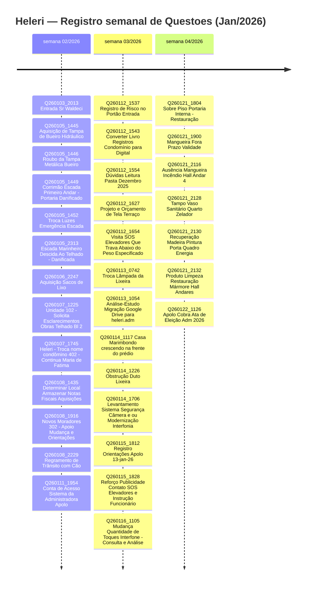

> O **SAGC** é a forma que **Gestão 2026** encontrou de **estar presente mesmo** quando precisar estar **ausente**


!!! Para ficar atualizado, sempre é possível começar lendo o **[[Visão Geral#Diário Bordo do Mês]]** <= **[[Visão Geral#Diário Bordo do Mês|CLIQUE AQUI]]**


# [Diário](https://heleriadm-collab.github.io/SAGCHeleri/diario/) 


| Semana         | S                                | T                                | Q                                | Q                                | S                                | S                                | D                                |
| -------------- | -------------------------------- | -------------------------------- | -------------------------------- | -------------------------------- | -------------------------------- | -------------------------------- | -------------------------------- |
| semana 01/2026 |                                  |                                  |                                  |                                  |                                  | [[diario/2026-01-03.md\|03 JAN]] | [[diario/2026-01-04.md\|04 JAN]] |
| semana 02/2026 | [[diario/2026-01-05.md\|05 JAN]] | [[diario/2026-01-06.md\|06 JAN]] | [[diario/2026-01-07.md\|07 JAN]] | [[diario/2026-01-08.md\|08 JAN]] | [[diario/2026-01-09.md\|09 JAN]] |                                  | [[diario/2026-01-11.md\|11 JAN]] |
| semana 03/2026 | [[diario/2026-01-12.md\|12 JAN]] | [[diario/2026-01-13.md\|13 JAN]] | [[diario/2026-01-14.md\|14 JAN]] | [[diario/2026-01-15.md\|15 JAN]] | [[diario/2026-01-16.md\|16 JAN]] |                                  |                                  |
| semana 04/2026 |                                  | [[diario/2026-01-20.md\|20 JAN]] | [[diario/2026-01-21.md\|21 JAN]] | [[diario/2026-01-22.md\|22 JAN]] | [[diario/2026-01-23.md\|23 JAN]] | [[diario/2026-01-24.md\|24 JAN]] | [[diario/2026-01-25.md\|25 JAN]] |
| semana 05/2026 | [[diario/2026-01-26.md\|26 JAN]] | [[diario/2026-01-27.md\|27 JAN]] | [[diario/2026-01-28.md\|28 JAN]] | [[diario/2026-01-29.md\|29 JAN]] | [[diario/2026-01-30.md\|30 JAN]] | [[diario/2026-01-31.md\|31 JAN]] | [[diario/2026-02-01.md\|01 FEV]] |
| semana 06/2026 |                                  |                                  |                                  |                                  |                                  |                                  |                                  |


> .. toda **informação** no SAGC **nasce** através dos **registros diários**.


# Eventos Relevantes

### RETORNO SR ROGERIO

> Sr Rogério **retorna das férias** dia **04/FEV**


# SOBRE O SACG Heleri

O **Sistema de Apoio a Gestão Condominial Heleri** ou **SACG Heleri** divulga informações acerca da gestão condominial.

No **SACG Heleri** é possível acompanhar diariamente atos e registros tomados pela Gestão iniciada em 2026.


---
# Sobre as Questões Registradas


As **questões** surgem à partir de registros diários de **situações pendentes**, **a resolver**, ou que **implicam em processos específicos** e/ou **obrigatórios**, tal como registro de nota fiscal, ou providência de correção.

> O registro de questões é importante para enxergarmos **o quanto há para ser feito**.


**Se** você **puder ajudar** na resolução de alguma questão registrada, **TODA E QUALQUER AJUDA SERÁ BEM VINDA!**


**Todas Questões CLIQUE EM =>** [TODAS QUESTÕES](https://heleriadm-collab.github.io/SAGCHeleri/questoes/)

**Questões ENCERRADAS CLIQUE EM =>**  [[Visão Geral#FEITO]]





---


# 📌 **Base Legal e Deveres do Síndico**

De acordo com a **[Lei nº 10.406/2002 (Código Civil)](https://www.planalto.gov.br/ccivil_03/leis/2002/l10406compilada.htm)**, em seu **[artigo 1.348](https://www.planalto.gov.br/ccivil_03/leis/2002/l10406.htm#art1348)**, o síndico tem o dever de:

- Diligir a conservação e a guarda das partes comuns;
    
- Realizar as assembleias e executar suas deliberações;
    
- **Prestar contas à assembleia anualmente, ou quando exigidas**;
    
- **Representar o condomínio ativa e passivamente**;
    
- **Manter em boa ordem a documentação condominial**;
    
- **Comunicar aos condôminos, por escrito, as ocorrências relativas ao condomínio**.
    

Além disso, a **Convenção do Condomínio** e o **Regimento Interno** podem estabelecer normas complementares sobre transparência, prestação de contas e meios de comunicação.


<!-- 
# Consolidado

[[Relatório MENSAL - 01 - 2026#Diário Bordo do Mês]]
[[Relatório MENSAL - 01 - 2026#Lembretes - Em Aberto]]
[[Relatório MENSAL - 01 - 2026#Tarefas Em Aberto]]
[[Relatório MENSAL - 01 - 2026#Agenda]]
[[Status Quo Por Assunto]]

Diário

Arquivos gerados à partir do Template File Daily v1.

Local exclusivo para arquivos dos registros diários. São dos registros diários que emergem todos os demais registros.

Para garantia de indexação, busca e relacionamento entre os itens, as anotações diárias deverão ser realizadas iniciando por "bullets", e preferencialmente utilizando Templates do tipo "Daily"

Componentes

Processos

registro de ato, registro de fato, registro de ronda, registro de episódio, registro de despesa, registro de comunicado, registro de reunião, registro de conformidade

Templates

Possui arquivos base que padronizam e trazem performance aos apontamentos.

As categorias de templates são:

(1) File - Templates de arquivos completos com  metadados próprios e qualificados em alguma categoria hashtag. Alguns templates tipo "File" são: (1) File Daily v1 (2) File Estudo v1 (3) File Orçamento v1 (4) File Episódio v1 (5) File Plano Geral v1 (6) File Pauta v1 (7) File Ata v1 (8) File Questão Aberta v1

(2) Daily - Templates blocos construtivos dos arquivos do tipo "File Daily v1". Alguns templates tipo "Daily" são: (1) registro de ato v1 (2) registro de fato v1 (3) registro de episódio (4) registro de reunião v1 (5) registro comunicado formal v1 (6) registro comunicado geral v1 (7) registro de entrega v1 (8) registro de agenda v1  

# Registros Diários

```dataview
table FROM #diario_heleri where !contains(file.name, "Template") 
SORT file.name DESC 
LIMIT 20 
```


# Relação Condôminos

```dataview
LIST 
FROM #pessoa/condomino 
```
# Relação Moradores

```dataview
LIST
FROM #pessoa/morador 
```
--> 


