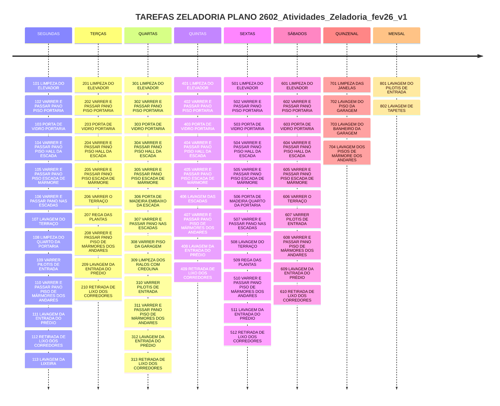
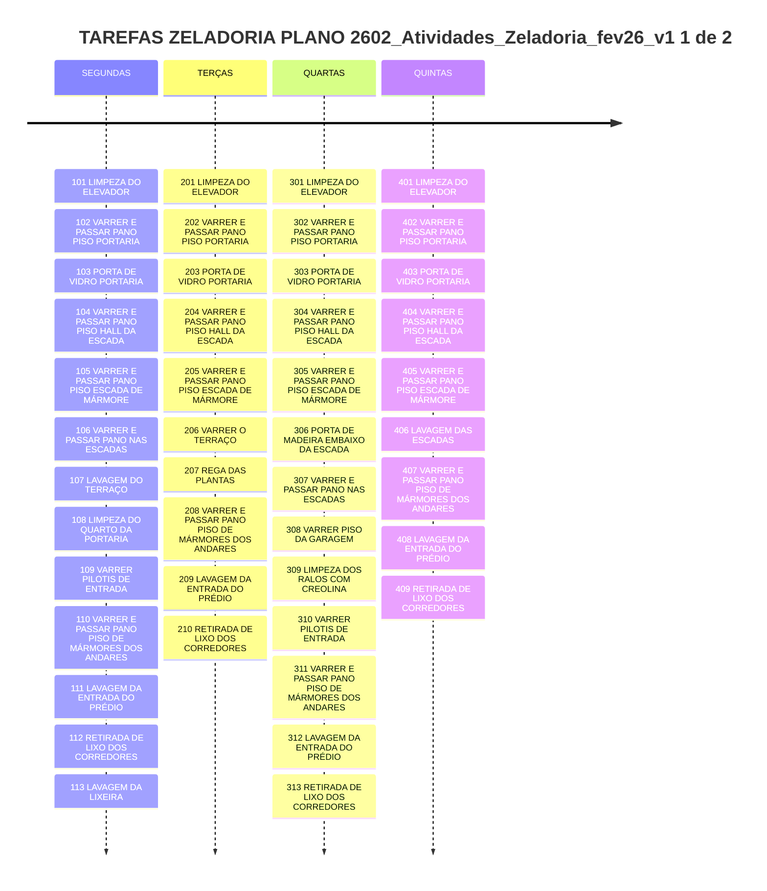
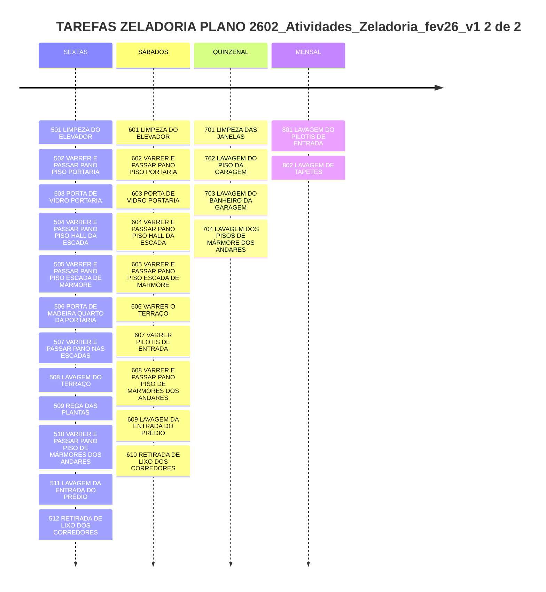
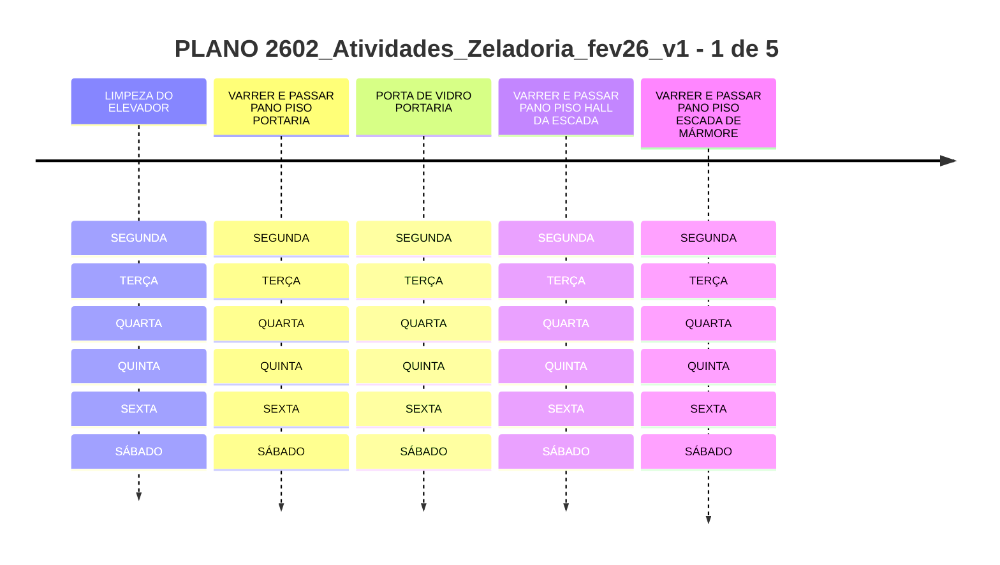
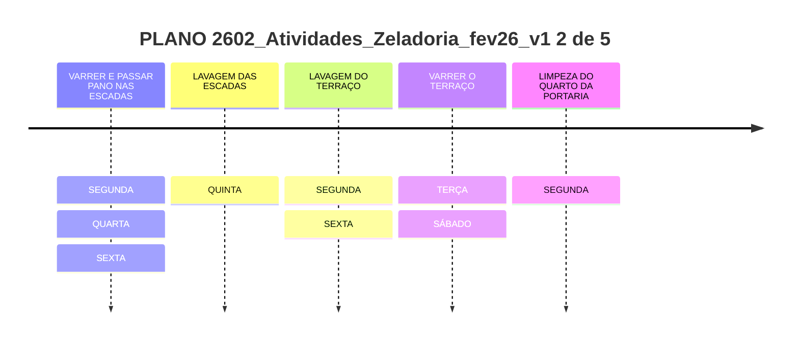
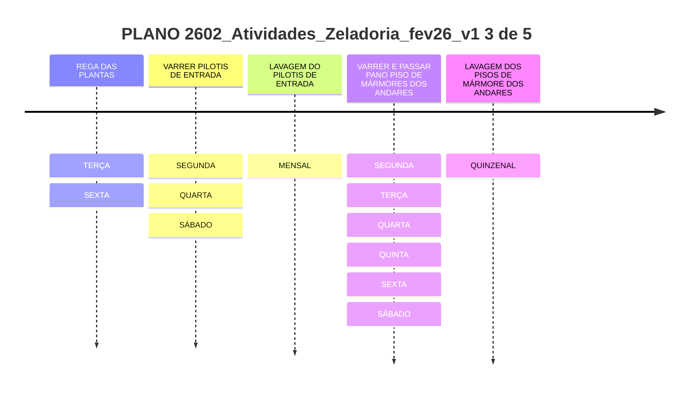
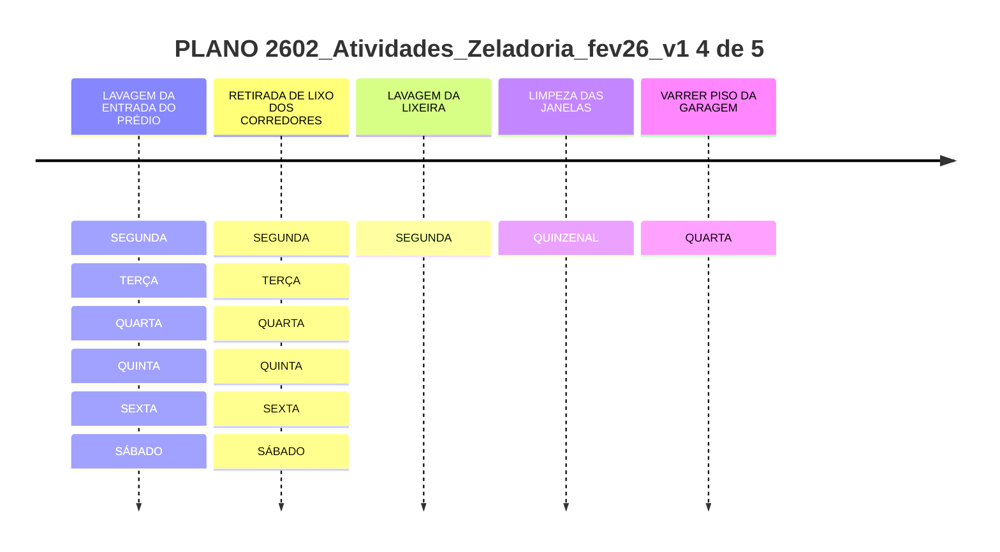
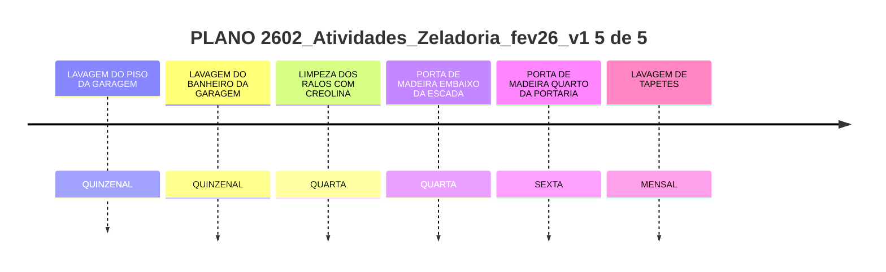

#documento/controle  #documento/plano 

- **Descrição:** Documento [[Plano das Atividades de Zeladoria]], com atividades planejadas para período **fevereiro 2026**
		- **Arquivo:** 

- **Objetivo:** **(1)** conforme [[Plano Comunicação e Controle Tarefas Zeladoria v01]] **(2)** Código Civil – Lei nº 10.406-2002 Art. 1.348, inciso V compete ao Síndico "diligenciar a conservação e a guarda das partes comuns e zelar pela prestação dos serviços que interessem aos possuidores."  **(3)** CLT – Art. 2º na qualidade de empresa que assume risco da atividade econômica, assalaria e dirige prestação pessoal de serviço

- **Motivação:** disposto em [[Plano Comunicação e Controle Tarefas Zeladoria v01]]

- **Autor:** [[Síndica]]

- **Compõe:** [[Plano Comunicação e Controle Tarefas Zeladoria v01]]

- **Composto por:** [[tarefas de zeladoria]]

- **Valor:** N/A

- **Análise:** 

- **md5:** 

- **Storage:** https://drive.google.com/drive/u/6/folders/1XcSr7U4v5i-w2guVehjPMMLZ6_YnsQho?q=Atividades_Zeladoria

- **Link:** 
		- (1) https://drive.google.com/file/d/1QiF0bWXza5TTLRbPbOSz6M4Ad32DSGqH/view?usp=sharing
		- (2) https://drive.google.com/file/d/19rboriNRaAJce5EDpFVrZ7Dz1PdY83qi/view?usp=sharing
		- (3) https://drive.google.com/file/d/1YWbMWs0ddm6wORprjS6USvDues6PuuWU/view?usp=sharing

# Visualização

<iframe src="https://drive.google.com/file/d/1QiF0bWXza5TTLRbPbOSz6M4Ad32DSGqH/preview" width="640" height="480"></iframe>

| TAREFAS                                                  | SEG | TER | QUA | QUI | SEX | SAB | QUINZENAL | MENSAL |
| -------------------------------------------------------- | --- | --- | --- | --- | --- | --- | --------- | ------ |
| LIMPEZA DO ELEVADOR                                      | X   | X   | X   | X   | X   | X   |           |        |
| VARRER  E PASSAR PANO PISO PORTARIA                      | X   | X   | X   | X   | X   | X   |           |        |
| PORTA DE VIDRO PORTARIA                                  | X   | X   | X   | X   | X   | X   |           |        |
| VARRER  E PASSAR PANO PISO HALL DA ESCADA                | X   | X   | X   | X   | X   | X   |           |        |
| VARRER  E PASSAR PANO PISO ESCADA DE MARMORE DA PORTARIA | X   | X   | X   | X   | X   | X   |           |        |
| PORTA DE MADEIRA EMBAIXO DA ESCADA                       |     |     | X   |     |     |     |           |        |
| PORTA DE MADEIRA QUARTO DA PORTARIA                      |     |     |     |     | X   |     |           |        |
| VARRER E PASSAR PANO NAS ESCADAS                         | X   |     | X   |     | X   |     |           |        |
| LAVAGEM DAS ESCADAS                                      |     |     |     | X   |     |     |           |        |
| LAVAGEM DO TERRAÇO                                       | X   |     |     |     | X   |     |           |        |
| VARRER O TERRAÇO                                         |     | X   |     |     |     | X   |           |        |
| LIMPEZA DAS JANELAS                                      |     |     |     |     |     |     | X         |        |
| VARRER PISO DA GARAGEM                                   |     |     | X   |     |     |     |           |        |
| LAVAGEM DO PISO DA GARAGEM                               |     |     |     |     |     |     | X         |        |
| LIMPEZA DO QUARTO DA PORTARIA                            | X   |     |     |     |     |     |           |        |
| REGA DAS PLANTAS                                         |     | X   |     |     | X   |     |           |        |
| LAVAGEM DO BANHEIRO DA GARAGEM                           |     |     |     |     |     |     | X         |        |
| LIMPEZA DOS RALOS COM CREOLINA                           |     |     | X   |     |     |     |           |        |
| VARRER PILOTIS DE ENTRADA                                | X   |     | X   |     |     | X   |           |        |
| LAVAGEM DO PILOTIS DE ENTRADA                            |     |     |     |     |     |     |           | X      |
| VARRER E PASSAR PANO PISO DE MARMORES DOS ANDARES        | X   | X   | X   | X   | X   | X   |           |        |
| LAVAGEM DOS PISOS DE MARMORE DOS ANDARES                 |     |     |     |     |     |     | X         |        |
| LAVAGEM DA ENTRADA DO PRÉDIO                             | X   | X   | X   | X   | X   | X   |           |        |
| RETIRADA DE LIXO DIARIA DOS  CORREDORES DOS ANDARES      | X   | X   | X   | X   | X   | X   |           |        |
| LAVAGEM DA LIXEIRA                                       | X   |     |     |     |     |     |           |        |
| LAVAGEM DE TAPETES                                       |     |     |     |     |     |     |           | X      |

[Visão online Tarefas Zeladoria](https://mermaid.live/view#pako:eNqll1tvokAUx7_KZJ7dRgZmRN6mMrVsuLgDNY0xMWShrYmXxsVmd5s-9KnZz-UX2wPWFVxFEB8UzLnN-f84M7zi78soxgZOpvN4Nl3E48U4SabJLEYBl-KG-2gkbG560uKo57k3nnQEGtjc9RBhbTLhyfRlGoVR_GMyimdhtFxNw8lD_ELY5EWBYAsEH1_071yT-9u79GMgpa0g23IGYsSR6SFhi2GapmhC0JBLKSSCnNz3uYQfyDywfPjyJJRo8aKHuv0fmQINLVOeMtNKAt9y20YmR8LvcfPAj5b4be3TzM7mXTqeFEVfdtzXhR5vXQ_600E2H_K-cNL-BEJKvvnwiiZ6voXf7rgMvLTy42vu7vIPLNsLLD-tVLiBPFyk0i5ZZG51EMDzEQdh4boYQdmXznc50hIHcvPHtIqLUAiSIrDkZ-9s697LAvc8qMH0_out5mODtQDXHWjQpc1HsY_kPGekNmekGmfkQs5IA87InrPj1BAAS4o-BADw0ic5OGyY3lB_AqhV1p8Abmf13zpkgBeLVc-rq9ZWV62mrnqhumoDdVVQ919pDjdT-JFwrnnWtePZOrXmjrqXfys4R30uUy2LVt1c330kuZ1J5qCeFJ5tucUa9iOlfPaoMDmasafCOKnMngrDpDJ71uGDop1nT6vNnlaNPe1C9rQG7GnA3r61R-HRTsFWWT8t3dOq6qcBhRX188X9gXz0vHy0tny0mnz0QvloA_nosdFRfmagNWcHzYt3fPehmWSndx_a-PRB65w-aJXTxydBm_drAKSQi51niNVmiFVjiF3IEGvAEDt3uGB7YsonPWt8ymB1ThmszinDckfC5Xbev5MXGsj9yl14LfKLJiQPf8nm2Wmrectr7t7Cw3jaWstZ-1lgP9-hYoO2ro5w_eIK9LZSLK9MHT2_FgGvggMRCB-38ONqGmEjWa3jFp7Hq3mY3uLX1HeMk6d4Ho-xAZdR_BCuZ8kYjxdv4PYcLkbL5XznuVquH5-w8RDOfsDd-jkKk9icho-rcG8SL6J41VuuFwk2aBYBG6_4Jza-EPVK0RVVI0TX212mkRb-hQ2le0UZ0aimU9btEr1D3lr4d5a0fUVVTekA-ApTGGN65-0vYPy6tg)

# Visão Planejamento Periodicidade e Suas Tarefas

A seguir, outras formas de visualizar o mesmo planejamento de modo a garantir a visão do todo planejado durante a semana.

## Zoom - Periodicidade e Suas Tarefas - 1 de 2

## Zoom - Periodicidade e Suas Tarefas - 2 de 2

# Visão Geral Todas Tarefas

```mermaid
timeline
    title TAREFAS ZELADORIA PLANO 2602_Atividades_Zeladoria_fev26_v1

    LIMPEZA DO ELEVADOR
        : SEGUNDA
        : TERÇA
        : QUARTA
        : QUINTA
        : SEXTA
        : SÁBADO

    VARRER E PASSAR PANO PISO PORTARIA
        : SEGUNDA
        : TERÇA
        : QUARTA
        : QUINTA
        : SEXTA
        : SÁBADO

    PORTA DE VIDRO PORTARIA
        : SEGUNDA
        : TERÇA
        : QUARTA
        : QUINTA
        : SEXTA
        : SÁBADO

    VARRER E PASSAR PANO PISO HALL DA ESCADA
        : SEGUNDA
        : TERÇA
        : QUARTA
        : QUINTA
        : SEXTA
        : SÁBADO

    VARRER E PASSAR PANO PISO ESCADA DE MÁRMORE
        : SEGUNDA
        : TERÇA
        : QUARTA
        : QUINTA
        : SEXTA
        : SÁBADO

    VARRER E PASSAR PANO NAS ESCADAS
        : SEGUNDA
        : QUARTA
        : SEXTA

    LAVAGEM DAS ESCADAS
        : QUINTA

    LAVAGEM DO TERRAÇO
        : SEGUNDA
        : SEXTA

    VARRER O TERRAÇO
        : TERÇA
        : SÁBADO

    LIMPEZA DO QUARTO DA PORTARIA
        : SEGUNDA

    REGA DAS PLANTAS
        : TERÇA
        : SEXTA

    VARRER PILOTIS DE ENTRADA
        : SEGUNDA
        : QUARTA
        : SÁBADO

    LAVAGEM DO PILOTIS DE ENTRADA
        : MENSAL

    VARRER E PASSAR PANO PISO DE MÁRMORES DOS ANDARES
        : SEGUNDA
        : TERÇA
        : QUARTA
        : QUINTA
        : SEXTA
        : SÁBADO

    LAVAGEM DOS PISOS DE MÁRMORE DOS ANDARES
        : QUINZENAL

    LAVAGEM DA ENTRADA DO PRÉDIO
        : SEGUNDA
        : TERÇA
        : QUARTA
        : QUINTA
        : SEXTA
        : SÁBADO

    RETIRADA DE LIXO DOS CORREDORES
        : SEGUNDA
        : TERÇA
        : QUARTA
        : QUINTA
        : SEXTA
        : SÁBADO

    LAVAGEM DA LIXEIRA
        : SEGUNDA

    LIMPEZA DAS JANELAS
        : QUINZENAL

    VARRER PISO DA GARAGEM
        : QUARTA

    LAVAGEM DO PISO DA GARAGEM
        : QUINZENAL

    LAVAGEM DO BANHEIRO DA GARAGEM
        : QUINZENAL

    LIMPEZA DOS RALOS COM CREOLINA
        : QUARTA

    PORTA DE MADEIRA EMBAIXO DA ESCADA
        : QUARTA

    PORTA DE MADEIRA QUARTO DA PORTARIA
        : SEXTA

    LAVAGEM DE TAPETES
        : MENSAL
```

# Visão Planejamento Por Tarefa e Sua Periodicidade

# Arquivos para Download

https://drive.google.com/file/d/19rboriNRaAJce5EDpFVrZ7Dz1PdY83qi/view?usp=sharing

<iframe src="https://drive.google.com/file/d/19rboriNRaAJce5EDpFVrZ7Dz1PdY83qi/preview" width="640" height="480"></iframe>

https://drive.google.com/file/d/1YWbMWs0ddm6wORprjS6USvDues6PuuWU/view?usp=sharing

<iframe src="https://drive.google.com/file/d/1YWbMWs0ddm6wORprjS6USvDues6PuuWU/preview" width="640" height="480"></iframe>

# metadado

[year:: 2026] | [month:: 02] | [day:: 05] | [dayWeek:: Thursday] | [dayWeekShort:: Thu] | [monthYear:: Feb] | [weekNumber:: 06] | [quarter:: 1] | [dayOfYear:: 036] | [weekNumber2:: 06-] | [month2:: 02-] | [day2:: 05-]