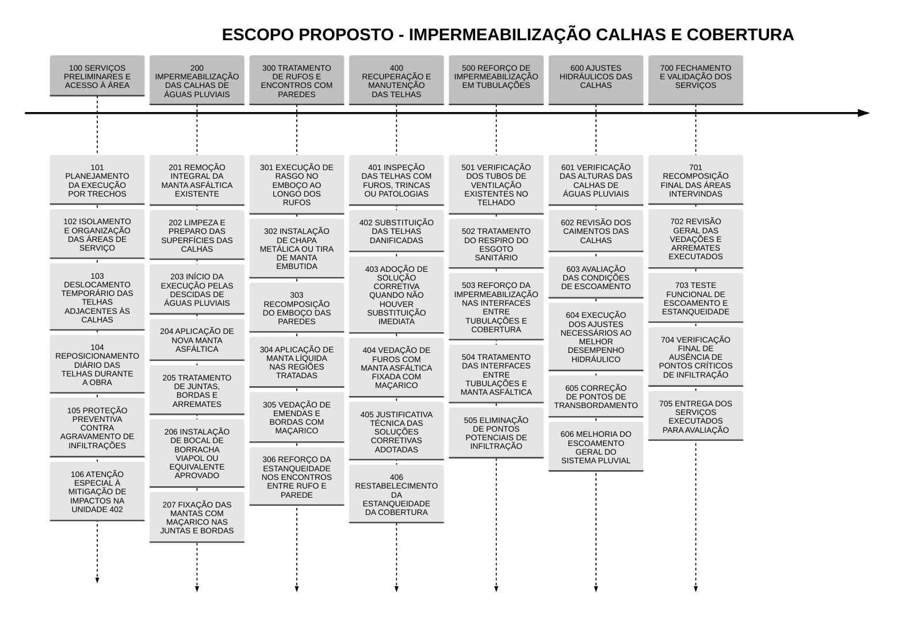

#documento 

- **Descrição:** (1) O documento terá duas partes. **A primeira parte** contendo escopo observando a garantia de finalização de trabalho iniciado e não finalizado pela contratada anterior, e conforme havia sido declarado via contrato [[20250717_4 CONTRATO - 3 CONDOMÍNIO EDIFICIO HELERI]].
		- (2) **A segunda parte** conterá itens de escopo trazidos por engenheiro perito, e que não foram observados na proposta original (no documento de contrato que não fora finalizado)
		- ---
		- OBS: Os arquivos serão gerados em versões a serem submetidas a aprovação da Síndica para produção da versão final
		- 
		- **Arquivo:** 
		- 
		- (1) DOC2603_Documento_Solicitação_Proposta_Comercial_e_Técnica_Telhado_Bloco_2_v1

- **Objetivo:** 

- **Motivação:** 

- **Autor:** [[Síndica]]

- **Compõe:** 

- **Composto por:** 

- **Valor:** N/A

- **Análise:** 

- **md5:** 

- **Storage:** https://drive.google.com/drive/u/2/folders/1t3HN9InjzH9Nl-fuoNmzeGcrLkLVrKXW

- **Link:** [[Google Drive Heleri Adm]]

<!--

Solicito redigir proposta para submissão a empresas de engenharia, com propósito de contratar para realizar obras de telhado e calha, que ficaram inacabadas e sem resolução de vício por parte da empresa anterior.
No anexo submeto documento referência contendo itens de escopo a serem cumpridos.

Itens da pauta:
1. Substituição da manta asfáltica das calhas de águas
pluviais
o Necessidade de remoção da manta asfáltica existente.
o Aplicação de nova manta asfáltica iniciando pelas
descidas de águas pluviais.
o Utilização de bocal de borracha da marca Viapol.
o Utilização de maçarico para fixação nas juntas e
bordas das mantas.

2. Deslocamento temporário de telhas para execução do
serviço
o Remoção temporária de telhas próximas às calhas para
permitir a execução correta do serviço.
o Fixação das mantas nas paredes da calha com uso de
maçarico.
o Reposicionamento diário das telhas deslocadas para
evitar agravamento de infiltrações, especialmente na
unidade 402.

3. Adequação dos rufos nas paredes
o Execução de rasgo no emboço das paredes ao longo
dos rufos.
o Instalação de chapa metálica ou tira de manta asfáltica
embutida.

o Recomposição do emboço e aplicação de manta
líquida no local.
o Vedação das emendas e bordas com maçarico.
4. Manutenção das telhas danificadas
o Substituição de telhas com presença de furos.
o Alternativamente, vedação dos furos com manta
asfáltica fixada com maçarico.

5. Reforço da impermeabilização de tubulações do telhado
o Reforço da impermeabilização dos tubos de ventilação
do telhado.
o Reforço da vedação no respiro do esgoto sanitário.
6. Verificação da altura das calhas de águas pluviais
o Revisão nas alturas das calhas.
o Ajustes necessários para evitar transbordamento.

--> 

<!-- REFERÊNCIA https://chatgpt.com/c/69bb0e2d-d22c-8333-8630-c01e7c5c1c9c -->
# Versão 1

**Solicitação formal de proposta** para envio a proponentes, contendo a exigência de **empresa registrada no CREA**, **responsável técnico habilitado** e **ART**. A fundamentação está alinhada à Lei nº 5.194/1966, à Lei nº 6.496/1977 e a normativos do Confea. ([Planalto](https://www.planalto.gov.br/ccivil_03/leis/L5194.htm"))

---

# Solicitação de Proposta Comercial e Técnica

**Execução de serviços corretivos em telhado, calhas pluviais, rufos e impermeabilização**

Prezados Senhores,

O **Condomínio Edifício Heleri** convida essa empresa a apresentar **proposta comercial e técnica** para execução de serviços corretivos no sistema de cobertura da edificação, abrangendo telhado, calhas de águas pluviais, rufos, elementos de vedação e pontos de impermeabilização associados. A presente contratação tem por finalidade a **conclusão de serviços anteriormente deixados inacabados**, bem como a **correção de falhas e vícios construtivos** não solucionados pela empresa anteriormente contratada, persistindo problemas de estanqueidade, infiltração e desempenho inadequado do sistema de drenagem pluvial. 

Por se tratar de **obra em condomínio** e de serviços enquadrados como atividade técnica de engenharia, somente serão admitidas propostas de **empresa legalmente habilitada e regularmente registrada no CREA**, com **responsável técnico formalmente vinculado**, detentor de atribuições compatíveis com o objeto contratual. A exigência decorre da Lei nº 5.194/1966, que disciplina o exercício das profissões de engenharia e submete o exercício dessas atividades por pessoas jurídicas ao devido registro, bem como da regulamentação do Confea sobre quadro técnico e responsabilidade técnica da pessoa jurídica. ([Planalto](https://www.planalto.gov.br/ccivil_03/leis/L5194.htm))

Será igualmente obrigatória a **emissão da ART – Anotação de Responsabilidade Técnica – antes do início dos serviços**, em conformidade com a Lei nº 6.496/1977 e com a orientação oficial do Confea, segundo a qual a ART deve ser registrada antes do início da atividade técnica. ([Confea](https://www.confea.org.br/servicos-prestados/anotacao-de-responsabilidade-tecnica-art))

## 1. Objeto da contratação

Constitui objeto da presente solicitação a contratação de empresa especializada para execução dos serviços necessários à recuperação funcional do sistema de cobertura, com foco na eliminação de infiltrações, recomposição de elementos construtivos comprometidos e melhoria do escoamento das águas pluviais, incluindo fornecimento de mão de obra, materiais, equipamentos, ferramentas, proteção das áreas afetadas, transporte e destinação dos resíduos gerados. 

## 2. Escopo mínimo dos serviços

A proposta deverá contemplar, no mínimo, os seguintes serviços:

### 2.1 Substituição da manta asfáltica das calhas de águas pluviais

Remoção integral da manta asfáltica atualmente existente e aplicação de nova manta, com início pelas descidas de águas pluviais, inclusive tratamento adequado das juntas, bordas e arremates. Deverá ser utilizado **bocal de borracha da marca Viapol**, ou equivalente técnico previamente justificado e aprovado, com fixação por **maçarico** nas juntas e bordas das mantas.

### 2.2 Deslocamento temporário de telhas para execução dos serviços

Remoção temporária das telhas situadas nas áreas adjacentes às calhas, na extensão necessária à correta execução dos serviços. Deverá ser prevista a fixação das mantas nas paredes da calha com uso de maçarico, bem como o **reposicionamento diário das telhas deslocadas**, de modo a evitar agravamento das infiltrações durante a execução, especialmente em relação à **unidade 402**.

### 2.3 Adequação dos rufos nas paredes

Execução de rasgo no emboço das paredes ao longo dos rufos, com instalação de **chapa metálica ou tira de manta asfáltica embutida**, seguida de recomposição do emboço, aplicação de manta líquida e vedação das emendas e bordas com maçarico.

### 2.4 Manutenção das telhas danificadas

Substituição das telhas que apresentem furos, trincas ou qualquer patologia incompatível com a estanqueidade exigida. Na impossibilidade de substituição imediata, poderá ser admitida solução corretiva com vedação dos furos mediante aplicação de manta asfáltica fixada com maçarico, desde que tecnicamente justificada.

### 2.5 Reforço da impermeabilização de tubulações do telhado

Execução de reforço da impermeabilização nos tubos de ventilação existentes no telhado, bem como no respiro do esgoto sanitário, com tratamento adequado das interfaces entre tubulações, manta e cobertura, de forma a eliminar pontos potenciais de infiltração.

### 2.6 Verificação da altura das calhas de águas pluviais

Revisão das alturas, caimentos e condições de escoamento das calhas de águas pluviais, com execução dos ajustes necessários para evitar transbordamentos e melhorar o desempenho hidráulico do sistema.

## 3. Requisitos obrigatórios de habilitação

A empresa proponente deverá comprovar que possui **registro ativo no CREA** compatível com as atividades a serem executadas e que mantém em seu quadro técnico **ao menos um profissional legalmente habilitado**, em respeito ao normativo do Confea ([CONFEA](https://normativos.confea.org.br/Ementas/Visualizar?id=68720)).

Para fins de análise da proposta e posterior contratação, deverá ser apresentado ou disponibilizado, quando solicitado pelo condomínio, o seguinte conjunto documental:

- comprovante de **registro ou visto da empresa no CREA** competente;
    
- identificação do **responsável técnico** pela obra;
    
- comprovação de regularidade profissional do responsável técnico indicado;
    
- comprovação de vínculo do profissional com a empresa, na forma admitida pelo Sistema Confea/Crea;
    
- compromisso expresso de emissão da **ART de obra ou serviço antes do início da execução**. ([Confea](https://www.confea.org.br/servicos-prestados/anotacao-de-responsabilidade-tecnica-art))
    

## 4. Conteúdo esperado da proposta

A proposta comercial e técnica deverá conter, de forma clara e objetiva:

- descrição da metodologia executiva;
    
- relação dos materiais previstos para utilização;
    
- prazo estimado para mobilização e execução;
    
- macro cronograma das etapas;
    
- prazo de garantia dos serviços;
    
- identificação do responsável técnico;
    
- valor global da proposta e condições de pagamento;
    
- validade da proposta;
    
- eventuais premissas, restrições ou exclusões de escopo.
    

A ausência de indicação de responsável técnico ou de regularidade da empresa perante o CREA poderá ensejar a desconsideração da proposta, por incompatibilidade com a natureza técnica do objeto. ([Planalto](https://www.planalto.gov.br/ccivil_03/leis/L5194.htm))

## 5. Condições de execução

A empresa contratada deverá executar os serviços com observância às boas práticas de engenharia, segurança do trabalho e técnicas adequadas de impermeabilização, assegurando proteção das áreas atingidas, organização do canteiro, descarte apropriado dos resíduos e **mitigação dos riscos de agravamento das infiltrações durante a execução**. A solução proposta deverá considerar o caráter corretivo da intervenção e a necessidade de restaurar o adequado desempenho do sistema de cobertura e drenagem pluvial. 

## 6. Vistoria técnica

Os proponentes deverão considerar, para adequada formulação de suas propostas, a realização de **vistoria técnica no local**, a fim de confirmar condições de acesso, interferências construtivas, extensão das patologias e demais particularidades executivas. A vistoria é recomendada como etapa relevante para a validação da solução proposta e prevenção de divergências futuras de escopo. 

## 7. Documentação anexa

Integram esta solicitação, como material de apoio à formulação da proposta:

- **fotografias do status quo do telhado e das calhas**;
    
- **indicação das dimensões** das áreas e elementos relevantes à execução;
    
- **vídeo demonstrativo do comportamento atual do sistema de calhas**, incluindo registros de **teste de estanqueidade** e de episódios de chuva ocorridos no **final de dezembro de 2025**.
    

Esses materiais devem ser utilizados pela proponente como referência inicial para compreensão das condições atualmente verificadas, sem prejuízo da indispensável confirmação técnica em vistoria local.

## 8. Considerações finais

XXXXXX

Atenciosamente,

**Ana Tereza Siqueira Marques Lins**  
**Síndica**  
**Condomínio Edifício Heleri**  
**+55 21 99506-9668**  
heleri.adm@gmail.com

[[Google Drive Heleri Adm]]
# Anexos

**Acervo de fotos submetidos ao Engenheiro Perito**

Link
https://drive.google.com/drive/folders/1zAjd3qPfP_LsS49ockXlygZRLQOvB6j-

## Item 01 - Dimensões Área Telhado - 10.5m2 X 9.50m2 - Visão Bloco 2

**Aproximadamente 100 metros (10,5m X 9,50m) quadrados área da laje que suporta o telhado.**

**Em vermelho a zona de concentração de água durante infiltrações**

https://drive.google.com/file/d/1Rx9u2Mg_0N53JCPUSLwW61Iua0FgUEsD/view
<iframe src="https://drive.google.com/file/d/1Rx9u2Mg_0N53JCPUSLwW61Iua0FgUEsD/preview" width="640" height="480"></iframe>

## Item 02 - Distribuição Aproximada dos Cômodos do Apartamento 402 - abaixo da laje

https://drive.google.com/file/d/1Yvgi8OGp3yYp1w5cYP1L1OSJijm0ube8/view
<iframe src="https://drive.google.com/file/d/1Yvgi8OGp3yYp1w5cYP1L1OSJijm0ube8/preview" width="640" height="480"></iframe>

##  Item 03 

https://drive.google.com/file/d/1SOMu6RdFWFwOQF7NpPWSmcAFx8S8U-4n/view
<iframe src="https://drive.google.com/file/d/1SOMu6RdFWFwOQF7NpPWSmcAFx8S8U-4n/preview" width="640" height="480"></iframe>

##  Item 04 - Aplicação da Manta de Forma Incorreta - Caimento, sobreposição e fixação

https://drive.google.com/file/d/1tMFLj4QeHEf2nFyko1Er98pdQXw_aD-d/view
<iframe src="https://drive.google.com/file/d/1tMFLj4QeHEf2nFyko1Er98pdQXw_aD-d/preview" width="640" height="480"></iframe>

https://drive.google.com/file/d/15K1v0aT5wicAix2NhLjXtHwojTInm1zJ/view
<iframe src="https://drive.google.com/file/d/15K1v0aT5wicAix2NhLjXtHwojTInm1zJ/preview" width="640" height="480"></iframe>

https://drive.google.com/file/d/17uZDidvaIHDD_RVkx_1mwf2voj-83NQu/view
<iframe src="https://drive.google.com/file/d/17uZDidvaIHDD_RVkx_1mwf2voj-83NQu/preview" width="640" height="480"></iframe>

## Item 05 Norma de Altura Mínima Calha Telhado

https://drive.google.com/file/d/1S3ronA8q4oD9ejecQT4UKco7uU_ECBgl/view
<iframe src="https://drive.google.com/file/d/1S3ronA8q4oD9ejecQT4UKco7uU_ECBgl/preview" width="640" height="480"></iframe>

## 06 Vídeo Estado do Vício Infiltração Via Sistema de Calhas-Telhado

https://www.youtube.com/watch?v=8eKyjuXzkyE

---

# Visualização 

# metadado

[year:: 2026] | [month:: 03] | [day:: 18] | [dayWeek:: Wednesday] | [dayWeekShort:: Wed] | [monthYear:: Mar] | [weekNumber:: 12] | [quarter:: 1] | [dayOfYear:: 077] | [weekNumber2:: 12-] | [month2:: 03-] | [day2:: 18-]