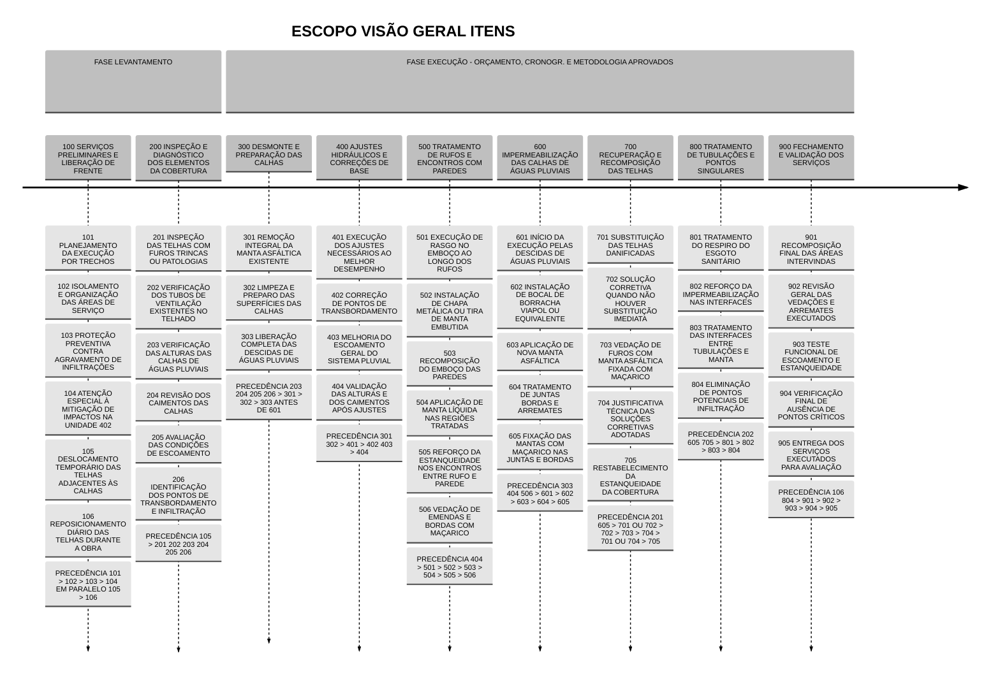
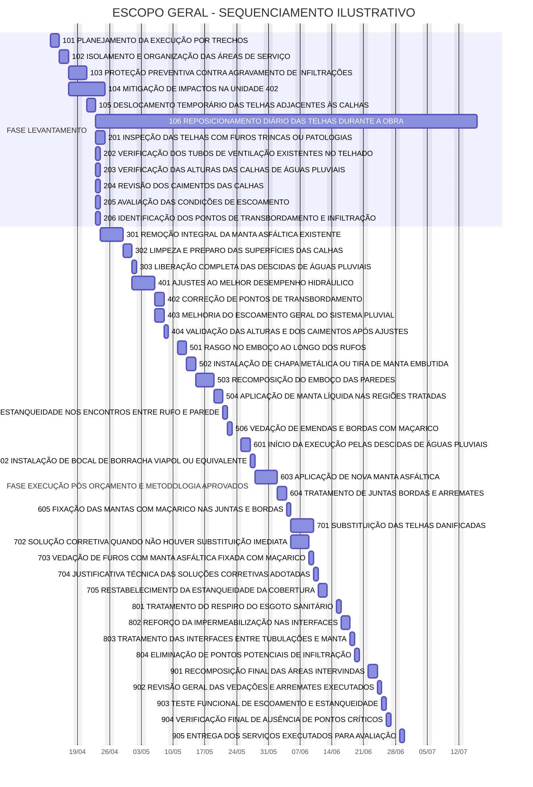

#documento 


<!-- 
```
VIDE https://chatgpt.com/c/69bb0e2d-d22c-8333-8630-c01e7c5c1c9c

REM == RETIRA-SE O MD5 PARA INTEGRIDADE ==
certutil -hashfile "20250717.pdf" md5
```
-->

- **Descrição:** No âmbito da questão [[Q260317_2227 Solicitação de Propostas Para Término Telhado Bloco 2]], documento proposta relatando escopo para fins término das [[Obras Telhado BL2]]
		- **Arquivo:** 
		- (1) versão 02: ` DOC2604_Termo_de_Referência_para_Solicitação_Propostas_Término_Telhado_Bloco_2_v02.pdf `

- **Objetivo:** No âmbito da questão [[Q260317_2227 Solicitação de Propostas Para Término Telhado Bloco 2]], documento proposta relatando escopo para fins término das [[Obras Telhado BL2]]

- **Motivação:** No âmbito da questão [[Q260317_2227 Solicitação de Propostas Para Término Telhado Bloco 2]] (1) conforme solicitado pela Síndica, ==trata-se da versão 02== do documento aos proponentes de finalização das obras do telhado bloco 2
		- (2) Síndica informa que a ==**versão 01 não atendeu**==  e portanto elabora-se novo texto de proposta. 
		- (ref.: versão 01 [[DOC2603_v01 Documento Solicitação Proposta Comercial e Técnica Telhado Bloco 2]])

- **Autor:** [[Síndica]]

- **Compõe:** [[Q260317_2227 Solicitação de Propostas Para Término Telhado Bloco 2]]

- **Composto por:** (1) [[260303_2026_LAUDO_TECNICO_DE_ENGENHARIA_TIJUCA_HELERI]]

- **Valor:** N/A

- **Análise:** 

- **md5:** N/A

- **Storage:** https://drive.google.com/drive/u/2/folders/1XcSr7U4v5i-w2guVehjPMMLZ6_YnsQho

- **Link:** 
		- (1) versão 02: ` DOC2604_Termo_de_Referência_para_Solicitação_Propostas_Término_Telhado_Bloco_2_v02.pdf `
		- https://drive.google.com/file/d/1Jl4BJuKHtjbKy2xdJPbkI_h2CsKMyViy/view
		- (2) docx editável ` DOC2604_Termo_de _eferência_para_Solicitação_Propostas_Término_Telhado_Bloco 2_v02.docx `
		- https://drive.google.com/file/d/1WXHTL8k8alUrD7CEi11JknGkTK2D1t-B/view

<!-- VIDE https://chatgpt.com/c/69bb0e2d-d22c-8333-8630-c01e7c5c1c9c -->

# Visualização 

https://drive.google.com/file/d/1Jl4BJuKHtjbKy2xdJPbkI_h2CsKMyViy/view
<iframe src="https://drive.google.com/file/d/1Jl4BJuKHtjbKy2xdJPbkI_h2CsKMyViy/preview" width="640" height="480"></iframe>

 [WBS](https://mermaid.ai/live/view#pako:eNqNWNtuGskW_ZVSH-XNE5lbG3hAKroLXFHT1ekLiiK_MDHxoLEhIliaTGRponmIZqQ8HZ0v4sfO2ru6oavxJVjCUF37UmuvfSm-eh8210tv6L169XW1Xu2G4uvVWogrb_fb8m555Q3x8dfFZ3w6q63PF9vV4tfb5WfawAKC9334_Wa7uV9fW7n_fORXKUo7Pm1Xd4vtl2Bzu9m-sCdf_rGr7zvn1-m-8WZ7vdw-u_Pz8sNmff2S3cOuFy0fdv6E7d1yu1u9ZLra9KLlauNPGL5drZcv6HrB2N1itR7_ftNwmp4-XK0fHl69ulrvVndLMmRFdqvd7VKoLDCJEXOd7f82YqpSGQmdqzi7WuNvB_B2q81aTGSmRKTmMs7lTMW5sTpa5-ciU-lc77-bTCSpivRMxzJVmcB2PYa6_XdSHCoxSSGnrBy9hpBuiSSSsXpjdYpQCvVOBYWVSUwq8lQFlyZzpdpCZyYqZZQw6VTG-n1lSWZi_y1V-AejlXOugg5cNbkqzaRqDk16LkVg4jyVQk5TOa9cUkLHEx3lfJL_qYYrXSEBllWkskQFGvjt_xIznevp8ex6lsggB0SxFEWsQ4m17nnb1dXDziwyQWk5VzMggKNoe6hcRZf4J8M3MiAkccy_MhFIWnUV-SJVicl0oE1cHUOfKAqLFNFUQgozTmVdAxAJVLj_N8ZpOEgjBn3EyI341GomEgmuqMiw57TqE2VIQxus0DHQKHGBdTmN9__Nch3ABcCgIsV-ZRTywIAneeH60IbZmo6a34GZiUmRQjZPdRxgxRRwJjeRmWoXija8nqtUT3RQxYLEirFhcnDYo_KJeqez3OIaG2srNK6yTlMZhSMizzP-bGNBmvffpgU-JVEx11I3fOoiPGW-kTuB1AcsHotnG_CCjpGuWQVREVHmI5mjJK6nZSXoCx3SGd3zJ8ZaUwBQxtnYpOEhl2pc_9s8wwmKOIWIECZg6FTkaNuyoFE4akn9C9J1_93aOxNBamIzTV_D8kzlJrQxFBLpOQf8JQ4d8AmpMTNEV0WuEPdqaJxg1oFrqZoZu0dDbkqFDWSbUQUTMpvsv0WgozzG3ZVvo3zNEvVeHgxaW1mRqHSy_xFolT1pvOPUPhA2iRSshkyOLNDhiyxx4G4ADOg7nJQdTkoyJ5m3UOmft6os7AI1-abI6MmlDlFJigj5R5U5MGmqjvQZI0Z1411or4WMOFMpiuFWlnEtwaJB1KJLlGmcCtVKxZfG1dM-mLJ18EnquWKdUi_OHpoau8v-hLWMgjaTJXaRK94VlC7hI1mqGhknE1Sl6nBP4k9oW6y7jDudq8ulELYquHuAG4fKj30jLSaMtoq5rxhbusAkFbrGeg28ISqzqaE6pGZjkNgQ1JGJpzYYrNhV0KZimcvo2HKCS5lIyioQnXiOIplrNDc8sjkA1UUOlFxFHeQNERbto4r-wQlC8lH30QWT6FhjKgvR_sfbAhbQ9eC0mmomHIMUyoaKHjZMqDTYKQBnid8WynbKmGA8gAh4UwsupSa746ryUabDoy_UaUKOPdPNRmGG5zJFOjwZdKLRiEMzYnxHDM6ITztih-n90PN86nlIgXSm5FhHzjjyU33B54ZHheVkDlLRzxcO_xEqjDFTRPZDmkoQA-OeTExEnFCIELKlWQB9KipuTGOU5JPy6cp0GxnwpsDurMIdowZqwUw2Us0HlBP9roYXG2nEiTlU6qsi-UzCdjh-PS6WPsfQ5xj6HEOfYwjDVfQuED0ooNpejQMneXCYQOpmL6A7K8aYbPLiZCM-xtx7w6ZQW2CALar2AFR4_HxbyBjpFtPqpSkwbDR1o25hlsqlq63jEt4ORxa9RrMjnHnieiIDLgAMFUP2mn3K9_8EMYly87NOUxYfvKaJ1OSnR6SEBg3HGPUCfRzvncR-avhrdL8Wc2TEYIOyFxzJ6r3D7936Y_vlENz-SWXGBFhE5TwvDl0p0_EUy6lLzz601qUNnSvRqa2MKNNYzBDnnJuiK9l2itpj5YFYTeNJOsFQ37Dbcew6G8si2DgHh9vVgUndXsmaLTjB_Yfg1VnjivPM2EfDHkXigqPR57Tqcxj6HIb-sRsOgPkEV7fDYOl0ZAK7ujXWrQ14bHPSbgLfo_qljkGY67hBuAGD7VxjSahMDIvPofzY6pofJ8xKByAHQymFYr48Re50Tc28TmBXuNu4HpSuw26RlQge8Q_S_Q-6DjUc6NnITqULUs1hvnfVLwTPTOk-M2DEuI4YohEfcsTe0nvPO_Nutqtrb7jb3i_PvLvl9m5BX73TH5aulx8X97c7-lHhAWKfFuv3m81dJbnd3N_85g0_Lm4_49v9p-vFbhmuFjfbxXHLcs2_g9yvd94Ql0TW4Q2_en94w1ar_7rT7Q_8Xr_fvhgMOv6Z98Ub_nIxeI2Rd9BuoXJftNq9hzPvT7bawvqg5fudft8fdCHw8H9tO00c)

[gantt](https://mermaid.ai/live/view#pako:eNqNWF1v2zYU_SuEgL4lXfTpjzdaoh0WtKjqw-iKvBixmgZNnCJxtm5FgRV9KDagT8N-kf_YDknJouw4mx8ahYrPvTz33MPLfnYu71a1M3auluvN5mJN8Nlcb25qwopYZpLMWE4FOSUFe12xNOZ0ztJSEi6qosxpyRfSfGm13NTTu_vb5YaQn_E5nc9Pk8S8W366fmjfvVj99OK2jXP5ga839f0vyxvi_lrXH8x6_eny5nFVPxC1VK9XDxdr8-Khvtxc363JlBaMCLagaWnSMa_dM5dkgqbsVZNkQgl7w-Jq-337TZJM5qTMWXwuC3LsM94A5IR4Z150ehacuj6eVy26R3ghRYPNiMxnNOVvqUFPaEG2X3OGHwkDW_mCb7_LJ-C9E7J8h02TJtQO3idZLkvWJJuzBeLwBSWxTME0obOcLtqNMcLTKRdYx5__w4oO3rfgPRs-IHNe8lmbLhDmGY1LkJFSUqU8oVgLsMlnqAn64NEOPARgIWTc5FeyOdgGHdwQUzJxjh80eUVj_AHy3f5RkJjq1RY8tMB7vEckZ5kseMxl2hLAD8CTKoceGKFETkBXP_HIwkacx_Xm-oZsRmduKy0P2uFpkbGumg1uLOdkWuXgqcx5GmNFViSjpRRyxmlhhfFUPe0w7RYgJ7JgOZ_yuKVfwVUTqcWiCy2aN-wNL0rDUSpNDols4L0-vLuD9_fhFdmiBCOFfm6YRqzt11mFp0xUC055YSfvH0MPwP-CF23eMeW6CD3oZz4KOziGHRKIWnArb8gd1TWqRsLKhpqiH4cPj8FHhCeK3T7zmTTpM5SUpsVE5smuq62--tbyHh3CP2FIttVs_4ZM8u33HeyclTIxkiEUfb5AVQsD4kN6OZtL81WO0s-U5cK85srgCC2m26-ixA46cRxw4FvaU3pQnKt_QmLy91dtMI8IdD57CzTlMhnNDe9FlbF8uv0Rc_ZcZVWoToe-bWE-4go-YS156JxMMOwg0dorYp48K8IG3bfQPZvtAETRVzh3kCCVoFScw9IBDLdh6bkk5zyB6VSCx_KIVAKLJsW7CdGSo9wvlnnOdh55XCnkaISOncBmJwA7JmVIAC1tCducsVgrVHnntGFGHED7x6ADorooeaL92V7PUq3NlsYeemChe8SE69gPlUxpMZPKl9h8ItXxhjIImc5MW-XV9JmjFSFCi30drt1AqM7WtCip6I6n-JxmVPUNxK-0D9ctOYwdr0xfIIeqxJ479I750KYnBPM496FGHCKtC-y2oMhCE7CE_UfuvoXu2egBSBWdwbT5ie2P15XKL0WEnM24tjQ1NNFkr68UfGDB-zZ8iC9PlZmYgQYspRjFzHmdgnBMZWpC0E-Yb3QZVG_rPRns0MIOOn8M4Y8LlnSJM4gk0aLRSjeH3xzvaX6kpxR6ZKH37DHSh6qylINZjIn_6QnjTdTrWV9Lh5iwLUnRE_qZYBoR5iHPKdREAJxJoYSEWRaTlbCcVIXp5KNDujtwf7_AKfz70J2fk09kySeyPSfCZrQmdpPdqwq4RVsBDDQwpDktj8hTQQcWtG-zEpIpf2OZgk55v6pKnk3MXd1t9NBCD-zyDlDeopoUJS8rfjA3JRiO1bGb0OfG7UHv3HKJideSM0BdMXJX7XkCJvRI_LqiKVo4VavnssLws58I7C7hYLUJ4j0RxNsF8ftdYKY9Q9JeiRWdCT1sCxWjK_CgPbcMfECU22oydPbl9s84VWj62DXbU9aw25-alKXlEgo9sNB9G13ZA5Q_YYLFvLv39GxCp4yDWR0JhxUILWiXmFjerspDrNkClSpexnNjojgPsFig1qWZyJ8q8rBXZE_zT0zgdh9DLNs2p0aUfM7ohIvdFUsJVY1H-RS3iOLJOF2dh_YJMESJ7T30gYxtYhyvRHudaj28B-5b4J6dekAYZiqe0v25IcN9Tt2ZebF3ZfsmD3MPLPjeyTvSA2Lv_JoimLDvnHo7C54e6baxuutY-NbZO9LMN_N9M4kApOkIQ0ZnQdrDSzW87qF3zI9s8xwp5iFG1VWpvsCJvame7Wn1MHHfgvZs6GDv2tOwgnyrYvuXIt6qRZxvf6CH-xOKgg8seN-GD40yZlRPN-2VvscBDlnau8EcJB9a6No9nRPn6v565Yw394_1iXNb398u1a_OZxX3wtm8r2_rC2eMx1X9bvl4s7lwLtZf8LWPy_Xbu7vb9pv3d49X753xu-XNA357_Kj-Bya5Xl7dL7s_qder-j6-w33XGfvhQGM448_OJ2c89F4G7mA0HI5G4dkodIMT5zdn7J699H3Pj84izx0OXW84-HLi_K6jui_dIBoMBqHvu4EXRUH05V-IdtlN)

# 1. Solicitação de Proposta Comercial e Técnica

**Execução de serviços corretivos em telhado, calhas pluviais, rufos e impermeabilização**

Prezados Senhores,

O **Condomínio Edifício Heleri** convida essa empresa a apresentar **proposta comercial e técnica** para execução de serviços corretivos no sistema de cobertura da edificação, abrangendo telhado, calhas de águas pluviais, rufos, elementos de vedação e pontos de impermeabilização associados.

A presente contratação tem por finalidade a **conclusão de serviços anteriormente deixados inacabados**, bem como a **correção de falhas e vícios construtivos** não solucionados pela empresa anteriormente contratada, persistindo problemas de estanqueidade, infiltração e desempenho inadequado do sistema de drenagem pluvial. 

# 2. Requisitos obrigatórios de habilitação

Para fins de análise da proposta e posterior contratação, deverá ser apresentado ou disponibilizado, quando solicitado pelo condomínio, o seguinte conjunto documental:

- comprovante de **registro ou visto da empresa no CREA** competente;
    
- identificação do **responsável técnico** pela obra;

- oferecimento de canal para eventual interlocução direta com **responsável técnico** pela obra, devendo o mesmo ser apresentado formalmente com presença em reunião;

- comprovação de regularidade profissional do responsável técnico indicado;
    
- comprovação de vínculo do profissional com a empresa, na forma admitida pelo Sistema Confea/Crea;
    
- compromisso expresso de emissão da **ART de obra ou serviço antes do início da execução**. ([Confea](https://www.confea.org.br/servicos-prestados/anotacao-de-responsabilidade-tecnica-art))

- disponibilidade do responsável pela execução a participar de canal de comunicação, podendo haver condôminos e/ou moradores em acompanhamento das mensagens, por vias de política de transparência adotada pela CONTRATANTE;

<!--
Por se tratar de **obra em condomínio** e de serviços enquadrados como atividade técnica de engenharia, somente serão admitidas propostas de **empresa legalmente habilitada e regularmente registrada no CREA**, com **responsável técnico formalmente vinculado**, detentor de atribuições compatíveis com o objeto contratual. A exigência decorre da Lei nº 5.194/1966, que disciplina o exercício das profissões de engenharia e submete o exercício dessas atividades por pessoas jurídicas ao devido registro, bem como da regulamentação do Confea sobre quadro técnico e responsabilidade técnica da pessoa jurídica. ([Planalto](https://www.planalto.gov.br/ccivil_03/leis/L5194.htm))

Também é obrigatória a **emissão da ART – Anotação de Responsabilidade Técnica – antes do início dos serviços**, em conformidade com a Lei nº 6.496/1977 e com a orientação oficial do Confea, segundo a qual a ART deve ser registrada antes do início da atividade técnica. ([Confea](https://www.confea.org.br/servicos-prestados/anotacao-de-responsabilidade-tecnica-art))
-->

# Sobre Conteúdo da Proposta

Por medida de garantia do entendimento mútuo, do escopo em contratação, define-se a elaboração da proposta em duas fases: 

(1) **Fase de levantamento metodológico-orçamentário** com advento de inspeção técnica local
(2) **Fase apresentação de proposta comercial** decorrente do escopo obrigatório e análise do local

Na fase de levantamento espera-se da PROPONENTE apreciação prévia dos itens **para determinação metodológica e de orçamento compatível**. 

Para orientação geral das questões a serem analisados durante a fase de levantamento, foram elencados os itens de escopo **dispostos no grupo 100 e grupo 200**, conforme poderá ser visto na seção "Itens do Escopo".

Na "Fase Apresentação Proposta Comercial" decorrente dos levantamentos realizados, o Condomínio Heleri tem expectativa de receber proposta comercial e técnica, a dispor de forma clara e objetiva:

- descrição da metodologia executiva;
    
- relação dos materiais previstos para utilização;
    
- prazo estimado para mobilização e execução;
    
- macro cronograma das etapas;
    
- prazo de garantia dos serviços;
    
- identificação do responsável técnico;
    
- valor global da proposta e condições de pagamento;
    
- validade da proposta;
    
- eventuais premissas, restrições ou exclusões de escopo;
    

**Importante!** A ausência de indicação de responsável técnico ou de regularidade da empresa perante o CREA e/ou CAU, poderá ensejar a desconsideração da proposta, por incompatibilidade com a natureza técnica do objeto. 

## 1. Objeto da contratação

Constitui objeto da presente solicitação a contratação de empresa especializada para execução dos serviços necessários à recuperação funcional do sistema de cobertura, com foco na eliminação de infiltrações, recomposição de elementos construtivos comprometidos e melhoria do escoamento das águas pluviais, incluindo fornecimento de mão de obra, materiais, equipamentos, ferramentas, proteção das áreas afetadas, transporte e destinação dos resíduos gerados. 

## 2. Escopo mínimo dos serviços

A proposta deverá contemplar, no mínimo, os seguintes serviços:

### 2.1 Substituição da manta asfáltica das calhas de águas pluviais

Remoção integral da manta asfáltica atualmente existente e aplicação de nova manta, com início pelas descidas de águas pluviais, inclusive tratamento adequado das juntas, bordas e arremates. Deverá ser utilizado **bocal de borracha da marca Viapol**, ou equivalente técnico previamente justificado e aprovado, com fixação por **maçarico** nas juntas e bordas das mantas.

### 2.2 Deslocamento temporário de telhas para execução dos serviços

Remoção temporária das telhas situadas nas áreas adjacentes às calhas, na extensão necessária à correta execução dos serviços. Deverá ser prevista a fixação das mantas nas paredes da calha com uso de maçarico, bem como o **reposicionamento diário das telhas deslocadas**, de modo a evitar agravamento das infiltrações durante a execução, especialmente em relação à **unidade 402**.

### 2.3 Adequação dos rufos nas paredes

Execução de rasgo no emboço das paredes ao longo dos rufos, com instalação de **chapa metálica ou tira de manta asfáltica embutida**, seguida de recomposição do emboço, aplicação de manta líquida e vedação das emendas e bordas com maçarico.

### 2.4 Manutenção das telhas danificadas

Substituição das telhas que apresentem furos, trincas ou qualquer patologia incompatível com a estanqueidade exigida. Na impossibilidade de substituição imediata, poderá ser admitida solução corretiva com vedação dos furos mediante aplicação de manta asfáltica fixada com maçarico, desde que tecnicamente justificada.

### 2.5 Reforço da impermeabilização de tubulações do telhado

Execução de reforço da impermeabilização nos tubos de ventilação existentes no telhado, bem como no respiro do esgoto sanitário, com tratamento adequado das interfaces entre tubulações, manta e cobertura, de forma a eliminar pontos potenciais de infiltração.

### 2.6 Verificação da altura das calhas de águas pluviais

Revisão das alturas, caimentos e condições de escoamento das calhas de águas pluviais, com execução dos ajustes necessários para evitar transbordamentos e melhorar o desempenho hidráulico do sistema.

# 3. Detalhamento Itens do Escopo 

A saber: todos os itens abaixo foram derivados de laudo de perito engenheiro civil independente contratado com a finalidade de identificar escopo necessário a conclusão da obra e correção de vícios deixados pela antiga contratada. 
<!-- [[260303_2026_LAUDO_TECNICO_DE_ENGENHARIA_TIJUCA_HELERI]] -->

## Fase Levantamento Metodológico Orçamentário

### 100 SERVIÇOS PRELIMINARES E LIBERAÇÃO DE FRENTE

101 PLANEJAMENTO DA EXECUÇÃO POR TRECHOS
Definição da estratégia de execução da obra por etapas ou segmentos, de modo a compatibilizar segurança, acesso, proteção contra chuvas e continuidade operacional da cobertura.

102 ISOLAMENTO E ORGANIZAÇÃO DAS ÁREAS DE SERVIÇO
Preparação e sinalização das áreas de trabalho, com organização de materiais, ferramentas e acessos, visando segurança, ordem e controle da frente de serviço.

103 PROTEÇÃO PREVENTIVA CONTRA AGRAVAMENTO DE INFILTRAÇÕES
Adoção de medidas provisórias para reduzir o risco de entrada de água durante a execução, especialmente em períodos de chuva ou durante abertura do sistema existente.

104 ATENÇÃO ESPECIAL À MITIGAÇÃO DE IMPACTOS NA UNIDADE 402
Previsão de cuidados adicionais para evitar agravamento de danos, infiltrações ou transtornos na unidade 402, indicada como área sensível durante a obra.

105 DESLOCAMENTO TEMPORÁRIO DAS TELHAS ADJACENTES ÀS CALHAS
Retirada ou afastamento temporário das telhas próximas às calhas, na extensão necessária para permitir acesso e execução correta dos serviços de impermeabilização e arremate.

106 REPOSICIONAMENTO DIÁRIO DAS TELHAS DURANTE A OBRA
Reposicionamento provisório das telhas ao final de cada jornada, com objetivo de reduzir exposição da cobertura e evitar agravamento de infiltrações.

### 200 INSPEÇÃO E DIAGNÓSTICO DOS ELEMENTOS DA COBERTURA

201 INSPEÇÃO DAS TELHAS COM FUROS TRINCAS OU PATOLOGIAS
Verificação das telhas para identificação de danos, perda de integridade, furos, trincas ou outras patologias que comprometam a estanqueidade da cobertura.

202 VERIFICAÇÃO DOS TUBOS DE VENTILAÇÃO EXISTENTES NO TELHADO
Levantamento das condições dos tubos de ventilação e de seus pontos de passagem pela cobertura, com foco em interfaces suscetíveis a infiltração.

203 VERIFICAÇÃO DAS ALTURAS DAS CALHAS DE ÁGUAS PLUVIAIS
Análise da conformação geométrica das calhas, incluindo cotas e posicionamento, para avaliar se há deficiência capaz de causar extravasamento ou mau funcionamento.

204 REVISÃO DOS CAIMENTOS DAS CALHAS
Verificação da inclinação das calhas e da condução da água em direção às descidas pluviais, identificando trechos com escoamento inadequado.

205 AVALIAÇÃO DAS CONDIÇÕES DE ESCOAMENTO
Exame do comportamento hidráulico do sistema, incluindo fluxo, retenção, refluxo, pontos de acúmulo e desempenho geral da drenagem pluvial.

206 IDENTIFICAÇÃO DOS PONTOS DE TRANSBORDAMENTO E INFILTRAÇÃO
Mapeamento dos locais críticos onde ocorrem extravasamentos, infiltrações ou falhas recorrentes de vedação, para orientar as correções.

## Escopo Mínimo 

### 300 DESMONTE E PREPARAÇÃO DAS CALHAS

301 REMOÇÃO INTEGRAL DA MANTA ASFÁLTICA EXISTENTE
Retirada completa da impermeabilização antiga nas calhas, inclusive emendas, sobras e materiais comprometidos, para permitir nova execução sobre base adequada.

302 LIMPEZA E PREPARO DAS SUPERFÍCIES DAS CALHAS
Limpeza técnica das superfícies e preparação do substrato, removendo impurezas, resíduos e partes soltas, de forma a garantir adequada aderência da nova impermeabilização.

303 LIBERAÇÃO COMPLETA DAS DESCIDAS DE ÁGUAS PLUVIAIS
Desobstrução e preparação das saídas de água pluvial, assegurando condições adequadas para conexão, arremate e escoamento do sistema.

### 400 AJUSTES HIDRÁULICOS E CORREÇÕES DE BASE

401 EXECUÇÃO DOS AJUSTES NECESSÁRIOS AO MELHOR DESEMPENHO
Realização das correções de geometria, apoio, alinhamento ou conformação da base das calhas que se mostrem necessárias ao correto funcionamento hidráulico.

402 CORREÇÃO DE PONTOS DE TRANSBORDAMENTO
Intervenção nos trechos identificados com extravasamento, visando eliminar causas construtivas ou funcionais associadas ao problema.

403 MELHORIA DO ESCOAMENTO GERAL DO SISTEMA PLUVIAL
Adoção de medidas para aperfeiçoar a condução da água ao longo das calhas e até as descidas, reduzindo retenções e sobrecargas localizadas.

404 VALIDAÇÃO DAS ALTURAS E DOS CAIMENTOS APÓS AJUSTES
Conferência técnica após os ajustes executados, para confirmar que alturas, inclinações e trajetos de escoamento ficaram compatíveis com o desempenho esperado.

### 500 TRATAMENTO DE RUFOS E ENCONTROS COM PAREDES

501 EXECUÇÃO DE RASGO NO EMBOÇO AO LONGO DOS RUFOS
Abertura controlada no emboço das paredes para criação de alojamento adequado ao embutimento do rufo ou do elemento de vedação complementar.

502 INSTALAÇÃO DE CHAPA METÁLICA OU TIRA DE MANTA EMBUTIDA
Implantação do elemento de arremate e vedação nos encontros entre cobertura e parede, com embutimento para maior proteção contra ingresso de água.

503 RECOMPOSIÇÃO DO EMBOÇO DAS PAREDES
Fechamento e recomposição do acabamento das paredes após embutimento dos elementos de vedação, restabelecendo integridade construtiva do conjunto.

504 APLICAÇÃO DE MANTA LÍQUIDA NAS REGIÕES TRATADAS
Aplicação de impermeabilizante líquido sobre as áreas reparadas ou recompostas, como reforço adicional de vedação e proteção superficial.

505 REFORÇO DA ESTANQUEIDADE NOS ENCONTROS ENTRE RUFO E PAREDE
Tratamento específico dos pontos de encontro entre rufo e parede, visando eliminar fragilidades de vedação nesses trechos críticos.

506 VEDAÇÃO DE EMENDAS E BORDAS COM MAÇARICO
Fixação e selagem das emendas, bordas e arremates das mantas com maçarico, assegurando fusão, aderência e continuidade do sistema impermeável.

<!-- EX ### 700 IMPERMEABILIZAÇÃO DAS CALHAS DE ÁGUAS PLUVIAIS -->
### 600 IMPERMEABILIZAÇÃO DAS CALHAS DE ÁGUAS PLUVIAIS

601 INÍCIO DA EXECUÇÃO PELAS DESCIDAS DE ÁGUAS PLUVIAIS
Início da nova impermeabilização a partir das descidas pluviais, por serem pontos sensíveis e estratégicos para assegurar continuidade do escoamento e estanqueidade.

602 INSTALAÇÃO DE BOCAL DE BORRACHA VIAPOL OU EQUIVALENTE
Instalação do bocal de transição nas saídas pluviais, utilizando componente especificado ou equivalente aprovado, com função de melhorar vedação e desempenho.

603 APLICAÇÃO DE NOVA MANTA ASFÁLTICA
Execução da nova camada de impermeabilização nas calhas, conforme solução técnica adotada, cobrindo os trechos previstos após preparo e ajustes da base.

604 TRATAMENTO DE JUNTAS BORDAS E ARREMATES
Execução dos acabamentos e reforços nas descontinuidades do sistema, incluindo encontros, bordas e pontos de transição da manta.

605 FIXAÇÃO DAS MANTAS COM MAÇARICO NAS JUNTAS E BORDAS
Fixação térmica da manta asfáltica nos pontos de junta, borda e arremate, visando assegurar aderência, vedação e estabilidade do sistema.

<!-- EX ### 800 RECUPERAÇÃO E RECOMPOSIÇÃO DAS TELHAS -->
### 700 RECUPERAÇÃO E RECOMPOSIÇÃO DAS TELHAS

701 SUBSTITUIÇÃO DAS TELHAS DANIFICADAS
Troca das telhas comprometidas por peças íntegras e compatíveis, restabelecendo proteção mecânica e estanqueidade da cobertura.

702 SOLUÇÃO CORRETIVA QUANDO NÃO HOUVER SUBSTITUIÇÃO IMEDIATA
Aplicação de solução provisória ou corretiva tecnicamente aceitável nos casos em que a substituição imediata da telha não puder ser realizada.

703 VEDAÇÃO DE FUROS COM MANTA ASFÁLTICA FIXADA COM MAÇARICO
Tratamento localizado de furos ou falhas pontuais em telhas por meio de manta asfáltica aderida termicamente, quando essa alternativa for admitida tecnicamente.

704 JUSTIFICATIVA TÉCNICA DAS SOLUÇÕES CORRETIVAS ADOTADAS
Registro da motivação técnica para adoção de reparos alternativos ou provisórios, especialmente quando não houver substituição integral do elemento danificado.

705 RESTABELECIMENTO DA ESTANQUEIDADE DA COBERTURA
Conjunto de ações finais para restituir a capacidade da cobertura de impedir ingresso de água, considerando telhas, arremates e interfaces tratadas.

<!-- EX ### 600 TRATAMENTO DE TUBULAÇÕES E PONTOS SINGULARES -->
### 800 TRATAMENTO DE TUBULAÇÕES E PONTOS SINGULARES

801 TRATAMENTO DO RESPIRO DO ESGOTO SANITÁRIO
Execução de vedação e reforço de impermeabilização no ponto correspondente ao respiro do esgoto sanitário, em razão de sua criticidade como interface de infiltração.

802 REFORÇO DA IMPERMEABILIZAÇÃO NAS INTERFACES
Reforço do sistema impermeável nos encontros entre elementos emergentes e a cobertura, com atenção aos pontos singulares de maior vulnerabilidade.

803 TRATAMENTO DAS INTERFACES ENTRE TUBULAÇÕES E MANTA
Execução de arremates e vedações compatíveis entre tubulações e manta asfáltica, garantindo continuidade da impermeabilização nessas transições.

804 ELIMINAÇÃO DE PONTOS POTENCIAIS DE INFILTRAÇÃO
Correção final dos pontos identificados como suscetíveis a entrada de água, após tratamento das interfaces e singularidades do sistema.

### 900 FECHAMENTO E VALIDAÇÃO DOS SERVIÇOS

901 RECOMPOSIÇÃO FINAL DAS ÁREAS INTERVINDAS
Reposição e acabamento final dos elementos removidos ou deslocados durante a obra, deixando as áreas em condição compatível com a conclusão dos serviços.

902 REVISÃO GERAL DAS VEDAÇÕES E ARREMATES EXECUTADOS
Inspeção final de todas as vedações, emendas, bordas, interfaces e acabamentos executados, para confirmação de conformidade com o escopo.

903 TESTE FUNCIONAL DE ESCOAMENTO E ESTANQUEIDADE
Realização de teste prático para verificar comportamento do sistema quanto ao escoamento das águas e à ausência de falhas de vedação.

904 VERIFICAÇÃO FINAL DE AUSÊNCIA DE PONTOS CRÍTICOS
Checagem conclusiva dos locais anteriormente identificados como sensíveis, confirmando eliminação ou mitigação dos pontos críticos de infiltração.

905 ENTREGA DOS SERVIÇOS EXECUTADOS PARA AVALIAÇÃO
Apresentação formal dos serviços concluídos para inspeção e avaliação pelo contratante, com vistas à aceitação técnica da obra.

## Visão Escopo Itens com Análise de Ordem de Execução

<!--
O presente escopo foi obtido à partir do [[260303_2026_LAUDO_TECNICO_DE_ENGENHARIA_TIJUCA_HELERI]]
-->


<!--
mermaid
%%{init: {
  "theme": "base",
  "themeVariables": {
    "background": "#ffffff",
    "primaryColor": "#ffffff",
    "primaryTextColor": "#000000",
    "primaryBorderColor": "#000000",
    "secondaryColor": "#ffffff",
    "secondaryTextColor": "#000000",
    "secondaryBorderColor": "#000000",
    "tertiaryColor": "#ffffff",
    "tertiaryTextColor": "#000000",
    "tertiaryBorderColor": "#000000",
    "lineColor": "#000000",
    "textColor": "#000000",
    "mainBkg": "#ffffff"
  }
}}%%
timeline
    title ESCOPO VISÃO GERAL ITENS (VERSAO ANTIGA MUDA-SE ORDENACAO)
Ordenação de execução:

300
400
500
700
800
600
900
    100 SERVIÇOS PRELIMINARES E LIBERAÇÃO DE FRENTE
        : 101 PLANEJAMENTO DA EXECUÇÃO POR TRECHOS
        : 102 ISOLAMENTO E ORGANIZAÇÃO DAS ÁREAS DE SERVIÇO
        : 103 PROTEÇÃO PREVENTIVA CONTRA AGRAVAMENTO DE INFILTRAÇÕES
        : 104 ATENÇÃO ESPECIAL À MITIGAÇÃO DE IMPACTOS NA UNIDADE 402
        : 105 DESLOCAMENTO TEMPORÁRIO DAS TELHAS ADJACENTES ÀS CALHAS
        : 106 REPOSICIONAMENTO DIÁRIO DAS TELHAS DURANTE A OBRA
        : PRECEDÊNCIA OBRIGATÓRIA 101 > 102 > 103 > 105

    200 INSPEÇÃO E DIAGNÓSTICO DOS ELEMENTOS DA COBERTURA
        : 201 INSPEÇÃO DAS TELHAS COM FUROS TRINCAS OU PATOLOGIAS
        : 202 VERIFICAÇÃO DOS TUBOS DE VENTILAÇÃO EXISTENTES NO TELHADO
        : 203 VERIFICAÇÃO DAS ALTURAS DAS CALHAS DE ÁGUAS PLUVIAIS
        : 204 REVISÃO DOS CAIMENTOS DAS CALHAS
        : 205 AVALIAÇÃO DAS CONDIÇÕES DE ESCOAMENTO
        : 206 IDENTIFICAÇÃO DOS PONTOS DE TRANSBORDAMENTO E INFILTRAÇÃO
        : PRECEDÊNCIA OBRIGATÓRIA 105 > 201 202 203 204 205 206

    300 DESMONTE E PREPARAÇÃO DAS CALHAS
        : 301 REMOÇÃO INTEGRAL DA MANTA ASFÁLTICA EXISTENTE
        : 302 LIMPEZA E PREPARO DAS SUPERFÍCIES DAS CALHAS
        : 303 LIBERAÇÃO COMPLETA DAS DESCIDAS DE ÁGUAS PLUVIAIS
        : PRECEDÊNCIA OBRIGATÓRIA 203 204 205 > 301 > 302

    400 AJUSTES HIDRÁULICOS E CORREÇÕES DE BASE
        : 401 EXECUÇÃO DOS AJUSTES NECESSÁRIOS AO MELHOR DESEMPENHO HIDRÁULICO
        : 402 CORREÇÃO DE PONTOS DE TRANSBORDAMENTO
        : 403 MELHORIA DO ESCOAMENTO GERAL DO SISTEMA PLUVIAL
        : 404 VALIDAÇÃO DAS ALTURAS E DOS CAIMENTOS APÓS AJUSTES
        : PRECEDÊNCIA OBRIGATÓRIA 301 302 > 401 > 402 > 404

    500 TRATAMENTO DE RUFOS E ENCONTROS COM PAREDES
        : 501 EXECUÇÃO DE RASGO NO EMBOÇO AO LONGO DOS RUFOS
        : 502 INSTALAÇÃO DE CHAPA METÁLICA OU TIRA DE MANTA EMBUTIDA
        : 503 RECOMPOSIÇÃO DO EMBOÇO DAS PAREDES
        : 504 APLICAÇÃO DE MANTA LÍQUIDA NAS REGIÕES TRATADAS
        : 505 REFORÇO DA ESTANQUEIDADE NOS ENCONTROS ENTRE RUFO E PAREDE
        : 506 VEDAÇÃO DE EMENDAS E BORDAS COM MAÇARICO
        : PRECEDÊNCIA OBRIGATÓRIA 401 402 404 > 501 > 502 > 503 > 504

    600 TRATAMENTO DE TUBULAÇÕES E PONTOS SINGULARES
        : 601 TRATAMENTO DO RESPIRO DO ESGOTO SANITÁRIO
        : 602 REFORÇO DA IMPERMEABILIZAÇÃO NAS INTERFACES ENTRE TUBULAÇÕES E COBERTURA
        : 603 TRATAMENTO DAS INTERFACES ENTRE TUBULAÇÕES E MANTA ASFÁLTICA
        : 604 ELIMINAÇÃO DE PONTOS POTENCIAIS DE INFILTRAÇÃO
        : PRECEDÊNCIA OBRIGATÓRIA 202 > 601 > 602 > 603

    700 IMPERMEABILIZAÇÃO DAS CALHAS DE ÁGUAS PLUVIAIS
        : 701 INÍCIO DA EXECUÇÃO PELAS DESCIDAS DE ÁGUAS PLUVIAIS
        : 702 INSTALAÇÃO DE BOCAL DE BORRACHA VIAPOL OU EQUIVALENTE APROVADO
        : 703 APLICAÇÃO DE NOVA MANTA ASFÁLTICA
        : 704 TRATAMENTO DE JUNTAS BORDAS E ARREMATES
        : 705 FIXAÇÃO DAS MANTAS COM MAÇARICO NAS JUNTAS E BORDAS
        : PRECEDÊNCIA OBRIGATÓRIA 404 505 603 > 701 > 702 > 703 > 704 > 705

    800 RECUPERAÇÃO E RECOMPOSIÇÃO DAS TELHAS
        : 801 SUBSTITUIÇÃO DAS TELHAS DANIFICADAS
        : 802 ADOÇÃO DE SOLUÇÃO CORRETIVA QUANDO NÃO HOUVER SUBSTITUIÇÃO IMEDIATA
        : 803 VEDAÇÃO DE FUROS COM MANTA ASFÁLTICA FIXADA COM MAÇARICO
        : 804 JUSTIFICATIVA TÉCNICA DAS SOLUÇÕES CORRETIVAS ADOTADAS
        : 805 RESTABELECIMENTO DA ESTANQUEIDADE DA COBERTURA
        : PRECEDÊNCIA OBRIGATÓRIA 705 > 801 OU 802 > 803 > 805

    900 FECHAMENTO E VALIDAÇÃO DOS SERVIÇOS
        : 901 RECOMPOSIÇÃO FINAL DAS ÁREAS INTERVINDAS
        : 902 REVISÃO GERAL DAS VEDAÇÕES E ARREMATES EXECUTADOS
        : 903 TESTE FUNCIONAL DE ESCOAMENTO E ESTANQUEIDADE
        : 904 VERIFICAÇÃO FINAL DE AUSÊNCIA DE PONTOS CRÍTICOS DE INFILTRAÇÃO
        : 905 ENTREGA DOS SERVIÇOS EXECUTADOS PARA AVALIAÇÃO
        : PRECEDÊNCIA OBRIGATÓRIA 805 > 901 > 902 > 903 > 904 > 905
-->




	FASE LEVANTAMENTO
    100 SERVIÇOS PRELIMINARES E LIBERAÇÃO DE FRENTE
        : 101 PLANEJAMENTO DA EXECUÇÃO POR TRECHOS
        : 102 ISOLAMENTO E ORGANIZAÇÃO DAS ÁREAS DE SERVIÇO
        : 103 PROTEÇÃO PREVENTIVA CONTRA AGRAVAMENTO DE INFILTRAÇÕES
        : 104 ATENÇÃO ESPECIAL À MITIGAÇÃO DE IMPACTOS NA UNIDADE 402
        : 105 DESLOCAMENTO TEMPORÁRIO DAS TELHAS ADJACENTES ÀS CALHAS
        : 106 REPOSICIONAMENTO DIÁRIO DAS TELHAS DURANTE A OBRA
        : PRECEDÊNCIA 101 > 102 > 103 > 104 EM PARALELO 105 > 106

    200 INSPEÇÃO E DIAGNÓSTICO DOS ELEMENTOS DA COBERTURA
        : 201 INSPEÇÃO DAS TELHAS COM FUROS TRINCAS OU PATOLOGIAS
        : 202 VERIFICAÇÃO DOS TUBOS DE VENTILAÇÃO EXISTENTES NO TELHADO
        : 203 VERIFICAÇÃO DAS ALTURAS DAS CALHAS DE ÁGUAS PLUVIAIS
        : 204 REVISÃO DOS CAIMENTOS DAS CALHAS
        : 205 AVALIAÇÃO DAS CONDIÇÕES DE ESCOAMENTO
        : 206 IDENTIFICAÇÃO DOS PONTOS DE TRANSBORDAMENTO E INFILTRAÇÃO
        : PRECEDÊNCIA 105 > 201 202 203 204 205 206

	FASE EXECUÇÃO PÓS ORÇAMENTO E METODOLOGIA APROVADOS
    300 DESMONTE E PREPARAÇÃO DAS CALHAS
        : 301 REMOÇÃO INTEGRAL DA MANTA ASFÁLTICA EXISTENTE
        : 302 LIMPEZA E PREPARO DAS SUPERFÍCIES DAS CALHAS
        : 303 LIBERAÇÃO COMPLETA DAS DESCIDAS DE ÁGUAS PLUVIAIS
        : PRECEDÊNCIA 203 204 205 206 > 301 > 302 > 303 ANTES DE 601

    400 AJUSTES HIDRÁULICOS E CORREÇÕES DE BASE
        : 401 EXECUÇÃO DOS AJUSTES NECESSÁRIOS AO MELHOR DESEMPENHO
        : 402 CORREÇÃO DE PONTOS DE TRANSBORDAMENTO
        : 403 MELHORIA DO ESCOAMENTO GERAL DO SISTEMA PLUVIAL
        : 404 VALIDAÇÃO DAS ALTURAS E DOS CAIMENTOS APÓS AJUSTES
        : PRECEDÊNCIA 301 302 > 401 > 402 403 > 404

    500 TRATAMENTO DE RUFOS E ENCONTROS COM PAREDES
        : 501 EXECUÇÃO DE RASGO NO EMBOÇO AO LONGO DOS RUFOS
        : 502 INSTALAÇÃO DE CHAPA METÁLICA OU TIRA DE MANTA EMBUTIDA
        : 503 RECOMPOSIÇÃO DO EMBOÇO DAS PAREDES
        : 504 APLICAÇÃO DE MANTA LÍQUIDA NAS REGIÕES TRATADAS
        : 505 REFORÇO DA ESTANQUEIDADE NOS ENCONTROS ENTRE RUFO E PAREDE
        : 506 VEDAÇÃO DE EMENDAS E BORDAS COM MAÇARICO
        : PRECEDÊNCIA 404 > 501 > 502 > 503 > 504 > 505 > 506

    600 IMPERMEABILIZAÇÃO DAS CALHAS DE ÁGUAS PLUVIAIS
        : 601 INÍCIO DA EXECUÇÃO PELAS DESCIDAS DE ÁGUAS PLUVIAIS
        : 602 INSTALAÇÃO DE BOCAL DE BORRACHA VIAPOL OU EQUIVALENTE
        : 603 APLICAÇÃO DE NOVA MANTA ASFÁLTICA
        : 604 TRATAMENTO DE JUNTAS BORDAS E ARREMATES
        : 605 FIXAÇÃO DAS MANTAS COM MAÇARICO NAS JUNTAS E BORDAS
        : PRECEDÊNCIA 303 404 506 > 601 > 602 > 603 > 604 > 605

    700 RECUPERAÇÃO E RECOMPOSIÇÃO DAS TELHAS
        : 701 SUBSTITUIÇÃO DAS TELHAS DANIFICADAS
        : 702 SOLUÇÃO CORRETIVA QUANDO NÃO HOUVER SUBSTITUIÇÃO IMEDIATA
        : 703 VEDAÇÃO DE FUROS COM MANTA ASFÁLTICA FIXADA COM MAÇARICO
        : 704 JUSTIFICATIVA TÉCNICA DAS SOLUÇÕES CORRETIVAS ADOTADAS
        : 705 RESTABELECIMENTO DA ESTANQUEIDADE DA COBERTURA
        : PRECEDÊNCIA 201 605 > 701 OU 702 > 702 > 703 > 704 > 701 OU 704 > 705

    800 TRATAMENTO DE TUBULAÇÕES E PONTOS SINGULARES
        : 801 TRATAMENTO DO RESPIRO DO ESGOTO SANITÁRIO
        : 802 REFORÇO DA IMPERMEABILIZAÇÃO NAS INTERFACES
        : 803 TRATAMENTO DAS INTERFACES ENTRE TUBULAÇÕES E MANTA
        : 804 ELIMINAÇÃO DE PONTOS POTENCIAIS DE INFILTRAÇÃO
        : PRECEDÊNCIA 202 605 705 > 801 > 802 > 803 > 804

    900 FECHAMENTO E VALIDAÇÃO DOS SERVIÇOS
        : 901 RECOMPOSIÇÃO FINAL DAS ÁREAS INTERVINDAS
        : 902 REVISÃO GERAL DAS VEDAÇÕES E ARREMATES EXECUTADOS
        : 903 TESTE FUNCIONAL DE ESCOAMENTO E ESTANQUEIDADE
        : 904 VERIFICAÇÃO FINAL DE AUSÊNCIA DE PONTOS CRÍTICOS
        : 905 ENTREGA DOS SERVIÇOS EXECUTADOS PARA AVALIAÇÃO
        : PRECEDÊNCIA 106 804 > 901 > 902 > 903 > 904 > 905


<!--
https://drive.google.com/file/d/17ZIWLm94MpUXkEAziS9U2NMyOjtXxcvj/view

iframe src="https://drive.google.com/file/d/17ZIWLm94MpUXkEAziS9U2NMyOjtXxcvj/preview" width="860" height="480"></iframe-->


## Visão Ilustrativa do Escopo Escopo Com Execução Sequenciada - Macro visão

Cronograma cuja **as estimativas de tempo** de execução **são meramente ilustrativas**. 

O objetivo é apresentar o sequenciamento das atividades elencadas de modo que sejam respeitadas as ordens de precedência, dado que laudo de perícia aponta que uma das falhas cometidas por antiga contratada, foi desconsiderar ordem de precedência na execução de determinados itens, acarretando na má qualidade da obra e permanência dos vícios.



<!--
mermaid-REESTRUTURADO PARA SEMANA DE 5 DIAS
gantt  
title ESCOPO SEQUENCIADO - (ESTIMATIVAS MERAMENTE ILUSTRATIVAS )  
dateFormat YYYY-MM-DD  
axisFormat %d/%m
section 100 SERVIÇOS PRELIMINARES E LIBERAÇÃO DE FRENTE
101 PLANEJAMENTO DA EXECUÇÃO POR TRECHOS                          :a101, 2026-04-01, 1d
102 ISOLAMENTO E ORGANIZAÇÃO DAS ÁREAS DE SERVIÇO                :a102, after a101, 1d
103 PROTEÇÃO PREVENTIVA CONTRA AGRAVAMENTO DE INFILTRAÇÕES       :a103, after a102, 1d
104 ATENÇÃO ESPECIAL À MITIGAÇÃO DE IMPACTOS NA UNIDADE 402      :a104, after a103, 1d
105 DESLOCAMENTO TEMPORÁRIO DAS TELHAS ADJACENTES ÀS CALHAS      :a105, after a104, 1d
106 REPOSICIONAMENTO DIÁRIO DAS TELHAS DURANTE A OBRA            :a106, after a105, 12d

section 200 INSPEÇÃO E DIAGNÓSTICO DOS ELEMENTOS DA COBERTURA
201 INSPEÇÃO DAS TELHAS COM FUROS TRINCAS OU PATOLOGIAS          :a201, after a105, 1d
202 VERIFICAÇÃO DOS TUBOS DE VENTILAÇÃO EXISTENTES NO TELHADO    :a202, after a201, 1d
203 VERIFICAÇÃO DAS ALTURAS DAS CALHAS DE ÁGUAS PLUVIAIS         :a203, after a202, 1d
204 REVISÃO DOS CAIMENTOS DAS CALHAS                             :a204, after a203, 1d
205 AVALIAÇÃO DAS CONDIÇÕES DE ESCOAMENTO                        :a205, after a204, 1d
206 IDENTIFICAÇÃO DOS PONTOS DE TRANSBORDAMENTO E INFILTRAÇÃO    :a206, after a205, 1d

section 300 DESMONTE E PREPARAÇÃO DAS CALHAS
301 REMOÇÃO INTEGRAL DA MANTA ASFÁLTICA EXISTENTE                :a301, after a206, 2d
302 LIMPEZA E PREPARO DAS SUPERFÍCIES DAS CALHAS                 :a302, after a301, 1d
303 LIBERAÇÃO COMPLETA DAS DESCIDAS DE ÁGUAS PLUVIAIS            :a303, after a302, 1d

section 400 AJUSTES HIDRÁULICOS E CORREÇÕES DE BASE
401 EXECUÇÃO DOS AJUSTES NECESSÁRIOS AO MELHOR DESEMPENHO        :a401, after a303, 2d
402 CORREÇÃO DE PONTOS DE TRANSBORDAMENTO                        :a402, after a401, 1d
403 MELHORIA DO ESCOAMENTO GERAL DO SISTEMA PLUVIAL              :a403, after a402, 1d
404 VALIDAÇÃO DAS ALTURAS E DOS CAIMENTOS APÓS AJUSTES           :a404, after a403, 1d

section 500 TRATAMENTO DE RUFOS E ENCONTROS COM PAREDES
501 EXECUÇÃO DE RASGO NO EMBOÇO AO LONGO DOS RUFOS               :a501, after a404, 1d
502 INSTALAÇÃO DE CHAPA METÁLICA OU TIRA DE MANTA EMBUTIDA       :a502, after a501, 1d
503 RECOMPOSIÇÃO DO EMBOÇO DAS PAREDES                           :a503, after a502, 1d
504 APLICAÇÃO DE MANTA LÍQUIDA NAS REGIÕES TRATADAS              :a504, after a503, 1d
505 REFORÇO DA ESTANQUEIDADE NOS ENCONTROS ENTRE RUFO E PAREDE   :a505, after a504, 1d
506 VEDAÇÃO DE EMENDAS E BORDAS COM MAÇARICO                     :a506, after a505, 1d

section 600 TRATAMENTO DE TUBULAÇÕES E PONTOS SINGULARES
601 TRATAMENTO DO RESPIRO DO ESGOTO SANITÁRIO                    :a601, after a202, 1d
602 REFORÇO DA IMPERMEABILIZAÇÃO NAS INTERFACES                  :a602, after a601, 1d
603 TRATAMENTO DAS INTERFACES ENTRE TUBULAÇÕES E MANTA           :a603, after a602, 1d
604 ELIMINAÇÃO DE PONTOS POTENCIAIS DE INFILTRAÇÃO               :a604, after a603, 1d

section 700 IMPERMEABILIZAÇÃO DAS CALHAS DE ÁGUAS PLUVIAIS
701 INÍCIO DA EXECUÇÃO PELAS DESCIDAS DE ÁGUAS PLUVIAIS          :a701, after a506, 1d
702 INSTALAÇÃO DE BOCAL DE BORRACHA VIAPOL OU EQUIVALENTE        :a702, after a701, 1d
703 APLICAÇÃO DE NOVA MANTA ASFÁLTICA                            :a703, after a702, 2d
704 TRATAMENTO DE JUNTAS BORDAS E ARREMATES                      :a704, after a703, 1d
705 FIXAÇÃO DAS MANTAS COM MAÇARICO NAS JUNTAS E BORDAS          :a705, after a704, 1d

section 800 RECUPERAÇÃO E RECOMPOSIÇÃO DAS TELHAS
801 SUBSTITUIÇÃO DAS TELHAS DANIFICADAS                          :a801, after a705, 1d
802 SOLUÇÃO CORRETIVA QUANDO NÃO HOUVER SUBSTITUIÇÃO IMEDIATA    :a802, after a801, 1d
803 VEDAÇÃO DE FUROS COM MANTA ASFÁLTICA FIXADA COM MAÇARICO     :a803, after a802, 1d
804 JUSTIFICATIVA TÉCNICA DAS SOLUÇÕES CORRETIVAS ADOTADAS       :a804, after a803, 1d
805 RESTABELECIMENTO DA ESTANQUEIDADE DA COBERTURA               :a805, after a804, 1d

section 900 FECHAMENTO E VALIDAÇÃO DOS SERVIÇOS
901 RECOMPOSIÇÃO FINAL DAS ÁREAS INTERVINDAS                     :a901, after a805, 1d
902 REVISÃO GERAL DAS VEDAÇÕES E ARREMATES EXECUTADOS            :a902, after a901, 1d
903 TESTE FUNCIONAL DE ESCOAMENTO E ESTANQUEIDADE                :milestone, a903, after a902, 0d
904 VERIFICAÇÃO FINAL DE AUSÊNCIA DE PONTOS CRÍTICOS             :a904, after a903, 1d
905 ENTREGA DOS SERVIÇOS EXECUTADOS PARA AVALIAÇÃO               :milestone, a905, after a904, 0d

-->


# metadado

[year:: 2026] | [month:: 03] | [day:: 28] | [dayWeek:: Saturday] | [dayWeekShort:: Sat] | [monthYear:: Mar] | [weekNumber:: 13] | [quarter:: 1] | [dayOfYear:: 087] | [weekNumber2:: 13-] | [month2:: 03-] | [day2:: 28-]